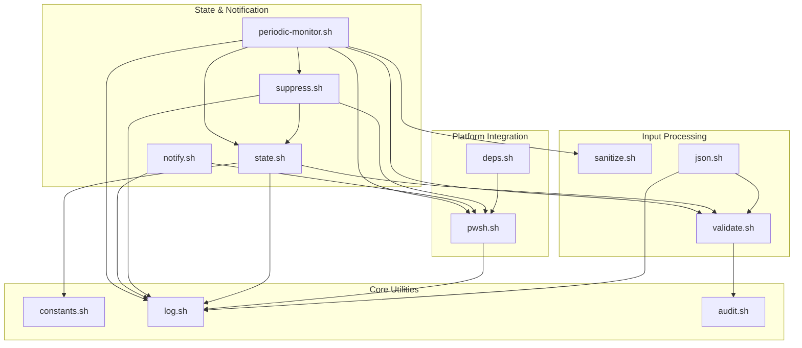

# C4 Code-Level Documentation: lib/

## Overview

- **Name**: Core Library Modules
- **Description**: Shared utility modules providing core functionality for notification system
- **Location**: [lib/](../../lib/)
- **Language**: Bash (Shell Script)
- **Purpose**: Provides reusable functions for state management, notification sending, input validation, logging, and cross-platform PowerShell integration

## Code Elements

### constants.sh

**Location**: [lib/constants.sh](../../lib/constants.sh)

| Function/Variable | Type | Description |
|-------------------|------|-------------|
| `CC_NOTIFY_VERSION` | Variable | Version string "1.0.0" |
| `STATE_BASE_DIR` | Variable | Base directory for state files (`$XDG_CACHE_HOME/cc-notify`) |
| `DEFAULT_CHECK_INTERVAL` | Variable | Background monitor check interval (30 seconds) |
| `DEFAULT_RUNNING_INTERVAL` | Variable | Periodic notification interval (5 minutes) |
| `DEFAULT_PROMPT_MAX_CHARS` | Variable | Max chars for prompt display (60) |
| `DEFAULT_SOUND_*` | Variables | Default Windows sound file paths |

### state.sh

**Location**: [lib/state.sh](../../lib/state.sh)

| Function | Signature | Description |
|----------|-----------|-------------|
| `atomic_write` | `atomic_write(file, content)` | Atomic file write using mktemp to prevent race conditions |
| `get_state_dir` | `get_state_dir(session_id) -> path` | Get state directory path with validation |
| `init_state` | `init_state(session_id) -> path` | Initialize state directory with secure permissions (700) |
| `cleanup_state` | `cleanup_state(session_id)` | Clean up state directory and kill monitor process |
| `set_task_start` | `set_task_start(session_id, user_prompt)` | Record task start time, prompt, and tmux info |
| `get_task_start_time` | `get_task_start_time(session_id) -> timestamp` | Get task start Unix timestamp |
| `get_user_prompt` | `get_user_prompt(session_id) -> string` | Get stored user prompt |
| `get_tmux_info` | `get_tmux_info(session_id) -> string` | Get tmux session:window:pane info |
| `get_tmux_session_name` | `get_tmux_session_name(session_id) -> string` | Extract tmux session name |
| `set_waiting_input` | `set_waiting_input(session_id)` | Mark task as waiting for user input |
| `clear_waiting_input` | `clear_waiting_input(session_id)` | Clear waiting input state |
| `is_waiting_input` | `is_waiting_input(session_id) -> bool` | Check if waiting for input |
| `is_task_running` | `is_task_running(session_id) -> bool` | Check if task is running |
| `get_last_periodic_time` | `get_last_periodic_time(session_id) -> timestamp` | Get last periodic notification time |
| `update_last_periodic_time` | `update_last_periodic_time(session_id)` | Update periodic notification timestamp |
| `set_monitor_pid` | `set_monitor_pid(session_id, pid)` | Save background monitor PID |
| `get_monitor_pid` | `get_monitor_pid(session_id) -> pid` | Get background monitor PID |
| `set_wt_hwnd` | `set_wt_hwnd(session_id, hwnd)` | Save Windows Terminal window handle |
| `get_wt_hwnd` | `get_wt_hwnd(session_id) -> hwnd` | Get Windows Terminal window handle |
| `update_last_tool_time` | `update_last_tool_time(session_id)` | Update last tool use timestamp |
| `get_last_tool_time` | `get_last_tool_time(session_id) -> timestamp` | Get last tool use timestamp |
| `get_elapsed_minutes` | `get_elapsed_minutes(session_id) -> int` | Calculate elapsed minutes since task start |

### notify.sh

**Location**: [lib/notify.sh](../../lib/notify.sh)

| Function | Signature | Description |
|----------|-----------|-------------|
| `send_notification` | `send_notification(type, session_id, title, body, [options...])` | Send Windows Toast notification via PowerShell |
| `build_tmux_info` | `build_tmux_info(session_id) -> string` | Build tmux info string for click-to-focus |

**Options for send_notification**:

- `-logo PATH` - App logo image path
- `-hero PATH` - Hero image path
- `-sound PATH` - Sound file path
- `-repeat N` - Sound repeat count
- `-update 0|1` - Update same notification
- `-tmux INFO` - Tmux pane info for click action

### pwsh.sh

**Location**: [lib/pwsh.sh](../../lib/pwsh.sh)

| Function | Signature | Description |
|----------|-----------|-------------|
| `get_execution_policy` | `get_execution_policy() -> string` | Get configured PowerShell execution policy (AllSigned/RemoteSigned/Bypass) |
| `find_pwsh` | `find_pwsh() -> path` | Find PowerShell executable with caching |
| `require_pwsh` | `require_pwsh() -> path` | Get PowerShell path or exit with error |
| `has_pwsh` | `has_pwsh() -> bool` | Check if PowerShell is available |

### suppress.sh

**Location**: [lib/suppress.sh](../../lib/suppress.sh)

| Function | Signature | Description |
|----------|-----------|-------------|
| `is_windows_terminal_foreground` | `is_windows_terminal_foreground() -> bool` | Check if Windows Terminal is foreground window |
| `get_active_client_info` | `get_active_client_info() -> string` | Get most recently active tmux client info |
| `is_target_window_visible` | `is_target_window_visible(target_window) -> bool` | Check if target tmux window is visible |
| `is_target_pane_visible` | `is_target_pane_visible(target_pane) -> bool` | Check if target pane is visible (considering zoom) |
| `should_suppress` | `should_suppress(session_id, [notify_type]) -> bool` | Main suppression check - returns 0 if should suppress |

### periodic-monitor.sh

**Location**: [lib/periodic-monitor.sh](../../lib/periodic-monitor.sh)

| Function | Signature | Description |
|----------|-----------|-------------|
| `cleanup_on_exit` | `cleanup_on_exit()` | Signal handler for TERM/INT - cleanup and exit |
| `send_periodic_notification` | `send_periodic_notification()` | Send periodic "running" notification |
| `main_loop` | `main_loop()` | Main monitoring loop - checks every 30s, sends notifications at configured interval |

**Main Loop Logic**:

1. Sleep for CHECK_INTERVAL (30s)
2. Check if task is still running
3. Check if Claude Code process exists
4. Skip if waiting for input
5. Skip if should suppress (user viewing pane)
6. Skip if task is idle (no tool use for 60s)
7. Send notification if interval reached

### validate.sh

**Location**: [lib/validate.sh](../../lib/validate.sh)

| Function | Signature | Description |
|----------|-----------|-------------|
| `validate_session_id` | `validate_session_id(session_id) -> safe_id` | Validate session_id format (alphanumeric, max 64 chars, no path traversal) |
| `validate_path_in_base` | `validate_path_in_base(path, base_dir) -> real_path` | Validate path is within base directory |
| `validate_tmux_pane` | `validate_tmux_pane(pane) -> safe_pane` | Validate tmux pane format |

### sanitize.sh

**Location**: [lib/sanitize.sh](../../lib/sanitize.sh)

| Function | Signature | Description |
|----------|-----------|-------------|
| `sanitize_display` | `sanitize_display(input, [max_len=200]) -> string` | Remove control characters, limit length |
| `to_base64` | `to_base64(input) -> base64_string` | Base64 encode for safe PowerShell parameter passing |
| `validate_base64` | `validate_base64(input) -> bool` | Validate Base64 format |
| `sanitize_for_shell` | `sanitize_for_shell(input) -> string` | Remove shell dangerous characters (backup method) |
| `safe_encode_for_pwsh` | `safe_encode_for_pwsh(input, [max_len=200]) -> base64` | Sanitize + Base64 encode for PowerShell |

### json.sh

**Location**: [lib/json.sh](../../lib/json.sh)

| Function | Signature | Description |
|----------|-----------|-------------|
| `validate_json` | `validate_json(input) -> bool` | Validate JSON structure using jq or fallback |
| `parse_session_id` | `parse_session_id(input) -> session_id` | Parse and validate session_id from JSON |
| `parse_prompt` | `parse_prompt(input) -> prompt` | Parse prompt field from JSON |
| `parse_json_field` | `parse_json_field(input, field) -> value` | Parse any field from JSON |

### log.sh

**Location**: [lib/log.sh](../../lib/log.sh)

| Function | Signature | Description |
|----------|-----------|-------------|
| `init_log` | `init_log()` | Initialize log file with secure permissions (600) |
| `sanitize_log_msg` | `sanitize_log_msg(msg, [max_len=1024]) -> string` | Sanitize log message (redact sensitive data) |
| `log_debug` | `log_debug(message)` | Log debug message (only when CC_NOTIFY_DEBUG=1) |
| `log_info` | `log_info(message)` | Log info message |
| `log_error` | `log_error(message)` | Log error message |
| `log_warn` | `log_warn(message)` | Log warning message |
| `run_quiet` | `run_quiet(command...)` | Execute command, capture stderr in debug mode |

### audit.sh

**Location**: [lib/audit.sh](../../lib/audit.sh)

| Function | Signature | Description |
|----------|-----------|-------------|
| `init_audit` | `init_audit()` | Initialize audit log file |
| `audit_log` | `audit_log(event, details)` | Write audit event in JSONL format |
| `audit_session_start` | `audit_session_start(session_id)` | Log session start event |
| `audit_session_end` | `audit_session_end(session_id)` | Log session end event |
| `audit_validation_failure` | `audit_validation_failure(field, reason)` | Log validation failure |
| `audit_notification_sent` | `audit_notification_sent(type)` | Log notification sent |
| `audit_rate_limited` | `audit_rate_limited(session_id)` | Log rate limiting event |
| `audit_permission_denied` | `audit_permission_denied(operation, resource)` | Log permission denied |

### deps.sh

**Location**: [lib/deps.sh](../../lib/deps.sh)

| Function | Signature | Description |
|----------|-----------|-------------|
| `detect_lang` | `detect_lang() -> "zh"|"en"` | Detect UI language from locale |
| `has_command` | `has_command(cmd) -> bool` | Check if command exists |
| `check_dependencies` | `check_dependencies() -> missing_list` | Check all dependencies, return missing ones |
| `check_burnttoast` | `check_burnttoast() -> bool` | Check if BurntToast PowerShell module is installed |
| `print_dependency_status` | `print_dependency_status()` | Print formatted dependency status |
| `all_dependencies_met` | `all_dependencies_met() -> bool` | Check if all dependencies are satisfied |

## Dependencies

### Internal Dependencies

- `constants.sh` → (none)
- `validate.sh` → `audit.sh`
- `log.sh` → (none)
- `audit.sh` → (none)
- `sanitize.sh` → (none)
- `json.sh` → `validate.sh`, `log.sh`
- `pwsh.sh` → `log.sh`
- `state.sh` → `constants.sh`, `validate.sh`, `log.sh`
- `suppress.sh` → `pwsh.sh`, `log.sh`, `state.sh`
- `notify.sh` → `pwsh.sh`, `log.sh`
- `periodic-monitor.sh` → `config.sh`, `state.sh`, `suppress.sh`, `pwsh.sh`, `log.sh`, `sanitize.sh`, `validate.sh`
- `deps.sh` → `pwsh.sh`

### External Dependencies

- `jq` - JSON processing (optional, has fallback)
- `tmux` - Terminal multiplexer
- `base64` - Base64 encoding
- `realpath` - Path normalization
- PowerShell 7 (`pwsh.exe`) - Windows notification API

## Relationships

