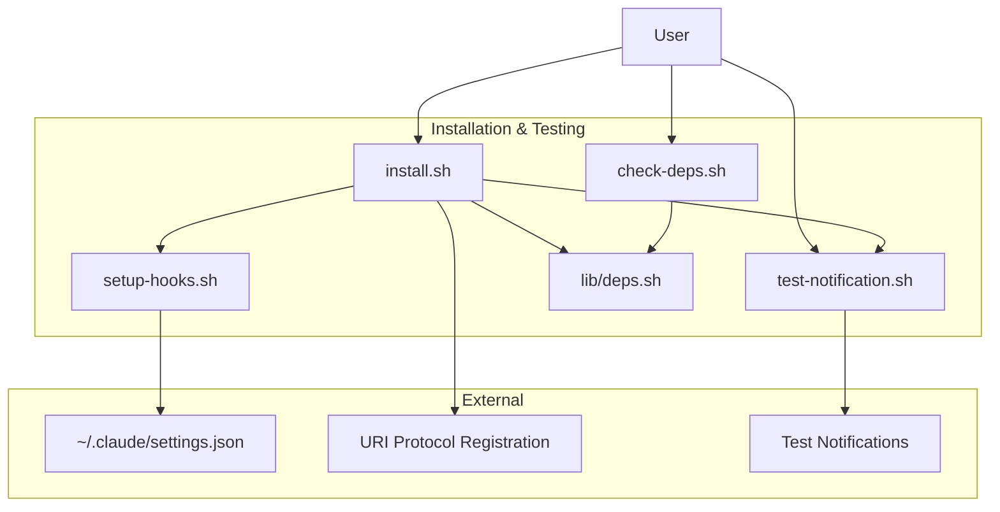
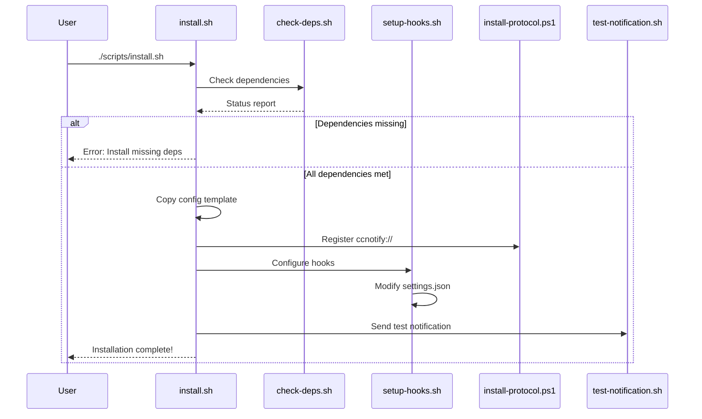

# C4 Component: Installation & Testing

## Overview

- **Name**: Installation & Testing
- **Description**: User-facing scripts for setup, configuration, and verification
- **Type**: Utility Component
- **Technology**: Bash Shell Script

## Purpose

The Installation & Testing component provides user-friendly scripts to install, configure, and test the notification system. It handles dependency checking, hook configuration, and notification testing.

**Key Responsibilities**:

- Check and report dependency status
- Install and configure the notification system
- Configure Claude Code hooks
- Test notification functionality

## Software Features

| Feature | Description |
|---------|-------------|
| Dependency Checking | Verify all required tools are installed |
| One-Click Installation | Complete setup with single command |
| Hook Configuration | Auto-configure Claude Code settings.json |
| Notification Testing | Test all notification types |
| Multi-Language Support | English and Chinese UI |

## Code Elements

This component contains the following code-level documentation:

- [c4-code-scripts.md](c4-code-scripts.md) - Installation and testing scripts
- [c4-code-lib.md](c4-code-lib.md) - Dependency checking (lib/deps.sh)

## Interfaces

### CLI Interface: install.sh

```bash
./scripts/install.sh [--lang zh|en]
```

**Steps**:

1. Check dependencies
2. Copy config template
3. Register URI protocol
4. Configure Claude Code hooks
5. Send test notification

### CLI Interface: setup-hooks.sh

```bash
./scripts/setup-hooks.sh
```

**Output**: Modifies `~/.claude/settings.json`

### CLI Interface: check-deps.sh

```bash
./scripts/check-deps.sh
```

**Output**: Dependency status report

### CLI Interface: test-notification.sh

```bash
./scripts/test-notification.sh [all|running|input|done|click|cleanup]
```

**Arguments**:

- `all` - Test all notification types
- `running` - Test periodic notification
- `input` - Test input-required notification
- `done` - Test completion notification
- `click` - Test click-to-focus
- `cleanup` - Remove test notifications

## Dependencies

### Components Used

- **Configuration Component** - For loading settings
- **Windows Notification Component** - For sending test notifications

### External Systems

- **Claude Code** - Hook configuration target
- **PowerShell** - Protocol registration
- **jq** - JSON manipulation (optional)

## Component Diagram



## Installation Flow



## Dependency Requirements

| Dependency | Required | Purpose |
|------------|----------|---------|
| jq | Recommended | JSON manipulation |
| tmux | Required | Terminal multiplexer |
| PowerShell 7 | Required | Windows notifications |
| BurntToast | Required | Toast API module |
| wslpath | Required | Path conversion |
