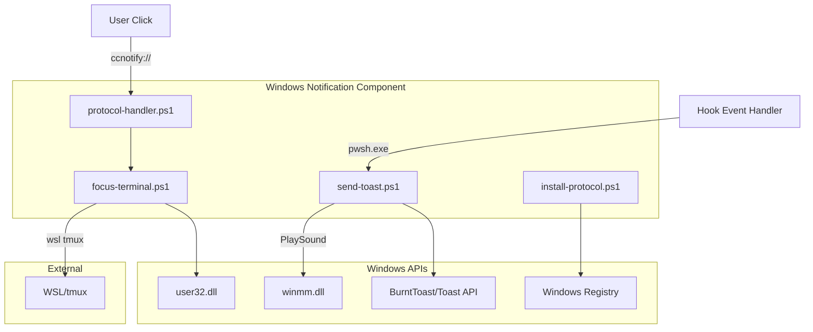

# C4 Component: Windows Notification

## Overview

- **Name**: Windows Notification
- **Description**: Sends Windows Toast notifications and handles click-to-focus actions
- **Type**: Application Component
- **Technology**: PowerShell 7, BurntToast Module, Windows API

## Purpose

The Windows Notification component interfaces with the Windows Toast API to display notifications and handles user interactions (clicks) to focus the terminal window and switch to the correct tmux pane.

**Key Responsibilities**:

- Create and display Windows Toast notifications
- Play notification sounds
- Handle notification click actions via URI protocol
- Focus Windows Terminal and switch tmux panes

## Software Features

| Feature | Description |
|---------|-------------|
| Toast Notifications | Display rich notifications with title, body, images |
| Sound Playback | Play custom sounds with configurable repeat |
| Click-to-Focus | Switch to task pane when notification clicked |
| Notification Grouping | Update/replace notifications by session |
| URI Protocol Handler | Handle `ccnotify://` protocol for click actions |

## Code Elements

This component contains the following code-level documentation:

- [c4-code-ps.md](c4-code-ps.md) - PowerShell script implementations

## Interfaces

### Input Interface: Notification Requests

| Parameter | Type | Description |
|-----------|------|-------------|
| `Type` | string | "running", "need_input", "done", "remove" |
| `SessionId` | string | Session identifier for grouping |
| `TitleB64` | string | Base64-encoded title |
| `BodyB64` | string | Base64-encoded body |
| `AppLogo` | string | Path to logo image |
| `HeroImage` | string | Path to hero image |
| `SoundPath` | string | Path to sound file |
| `SoundRepeat` | int | Sound repeat count |
| `TmuxInfoB64` | string | Base64-encoded tmux info |

### Output Interface: User Actions

| Action | Trigger | Effect |
|--------|---------|--------|
| Click notification | User clicks toast | Invoke `ccnotify://` URI |
| Focus terminal | URI handler | SetForegroundWindow + tmux select-pane |

### Protocol Interface: ccnotify://

| URI Format | Description |
|------------|-------------|
| `ccnotify://{pane}:{hwnd}` | Focus window and switch pane |

## Dependencies

### Components Used

- None (leaf component)

### External Systems

- **BurntToast** - PowerShell module for Toast API
- **Windows API** - user32.dll, winmm.dll for window/sound control
- **Windows Registry** - URI protocol registration
- **WSL** - For tmux pane switching

## Component Diagram

## Notification Types

### Running Notification

- Updates same toast (by session tag)
- Shows elapsed time and prompt
- Optional app logo
- Configurable sound

### Need Input Notification

- Creates new toast each time
- Higher urgency sound (default: 2 repeats)
- Immediate delivery

### Done Notification

- Clears running notification first
- Shows hero image
- Celebration sound (tada.wav)

## Security Considerations

- **SEC-2026-0112-0409 H1**: Base64 decoding for safe parameter handling
- **SEC-2026-0112-0409 H3**: Idempotent Add-Type to prevent redefinition attacks
- **SEC-2026-0112-0409 H4**: TmuxPane format validation in protocol handler
- **SEC-2026-0112-0409 M4**: User confirmation for registry modifications
