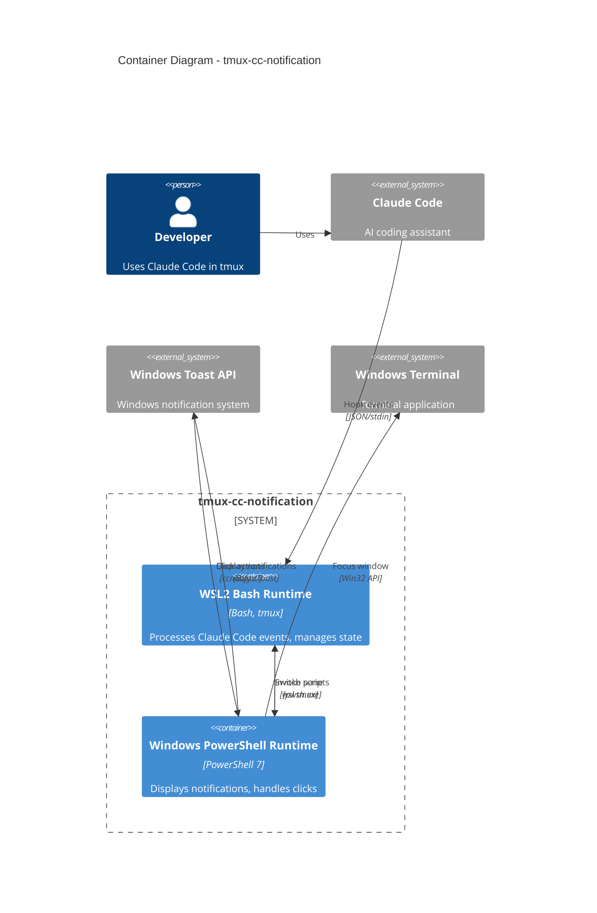
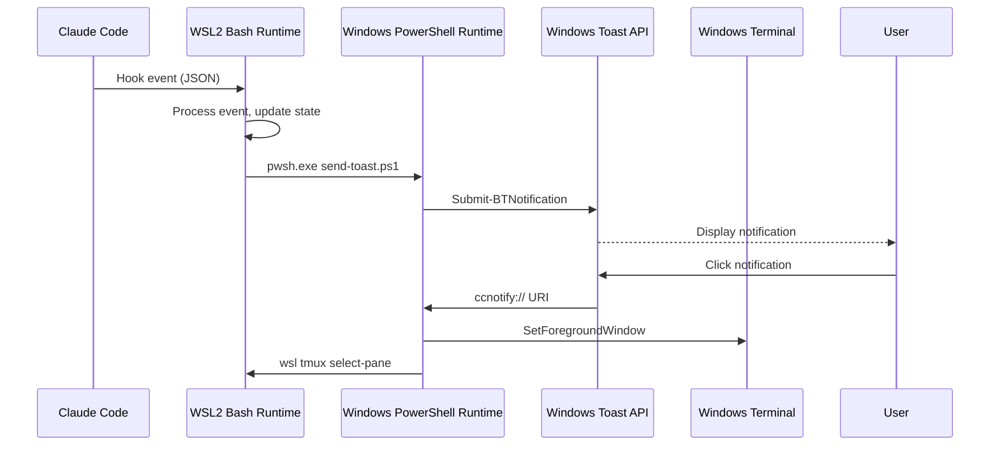

# C4 Container-Level Documentation

## Containers Overview

The tmux-cc-notification system consists of two main containers that communicate across the WSL2/Windows boundary:

| Container | Type | Technology | Description |
|-----------|------|------------|-------------|
| WSL2 Bash Runtime | Application | Bash, tmux | Processes Claude Code events and manages state |
| Windows PowerShell Runtime | Application | PowerShell 7, BurntToast | Displays notifications and handles user interactions |

## Container: WSL2 Bash Runtime

### Overview

- **Name**: WSL2 Bash Runtime
- **Type**: Application
- **Technology**: Bash Shell, tmux
- **Deployment**: WSL2 Linux environment

### Purpose

Runs within the WSL2 environment alongside Claude Code. Receives hook events, manages task state, and coordinates notification delivery.

### Components

| Component | Description |
|-----------|-------------|
| [Hook Event Handler](c4-component-hook-handler.md) | Processes Claude Code lifecycle events |
| [Configuration](c4-component-configuration.md) | Manages application settings |
| [Installation & Testing](c4-component-installation.md) | Setup and verification scripts |

### Interfaces

#### Input: Claude Code Hooks

| Event | Protocol | Description |
|-------|----------|-------------|
| UserPromptSubmit | stdin JSON | Task started |
| PreToolUse | stdin JSON | Tool being used |
| Notification | stdin JSON | Input required |
| Stop | stdin JSON | Task completed |

#### Output: PowerShell Invocation

| Operation | Protocol | Description |
|-----------|----------|-------------|
| send-toast.ps1 | Process spawn | Send notification |
| install-protocol.ps1 | Process spawn | Register URI protocol |

### Infrastructure

- **State Storage**: `$XDG_CACHE_HOME/cc-notify/{session_id}/`
- **Log Storage**: `$XDG_STATE_HOME/cc-notify/`
- **Config File**: `.tmux_cc_notify_conf.toml`

---

## Container: Windows PowerShell Runtime

### Overview

- **Name**: Windows PowerShell Runtime
- **Type**: Application
- **Technology**: PowerShell 7, BurntToast Module
- **Deployment**: Windows host (via pwsh.exe)

### Purpose

Runs on the Windows host to interface with the Windows Toast API. Displays notifications and handles click-to-focus actions.

### Components

| Component | Description |
|-----------|-------------|
| [Windows Notification](c4-component-windows-notification.md) | Toast notifications and click handling |

### Interfaces

#### Input: Script Invocation

| Script | Parameters | Description |
|--------|------------|-------------|
| send-toast.ps1 | Type, SessionId, TitleB64, BodyB64, ... | Send notification |
| focus-terminal.ps1 | TmuxPane, WindowHandle | Focus window |
| protocol-handler.ps1 | Uri | Handle ccnotify:// click |

#### Output: Windows APIs

| API | Protocol | Description |
|-----|----------|-------------|
| BurntToast | PowerShell Module | Toast notifications |
| user32.dll | P/Invoke | Window management |
| winmm.dll | P/Invoke | Sound playback |
| Registry | PowerShell | URI protocol registration |

### Infrastructure

- **URI Protocol**: `ccnotify://` registered in `HKCU:\Software\Classes\ccnotify`
- **Dependencies**: BurntToast PowerShell module

---

## Container Diagram



## Communication Flow



## API Specifications

### WSL → PowerShell Interface

See [apis/wsl-powershell-api.yaml](apis/wsl-powershell-api.yaml)

### URI Protocol Interface

| URI | Format | Description |
|-----|--------|-------------|
| ccnotify:// | `ccnotify://{pane_id}:{hwnd}` | Focus terminal and switch pane |

## Deployment

### Prerequisites

| Requirement | Container | Description |
|-------------|-----------|-------------|
| WSL2 | WSL2 Bash | Windows Subsystem for Linux 2 |
| tmux | WSL2 Bash | Terminal multiplexer |
| jq | WSL2 Bash | JSON processor (optional) |
| PowerShell 7 | Windows PS | PowerShell Core |
| BurntToast | Windows PS | Toast notification module |

### Installation

```bash
# In WSL2
cd tmux-cc-notification
./scripts/install.sh
```

This will:

1. Check dependencies in both containers
2. Register URI protocol in Windows
3. Configure Claude Code hooks
4. Test notification delivery

## Related Documentation

- [Component Index](c4-component.md)
- [System Context](c4-context.md)
