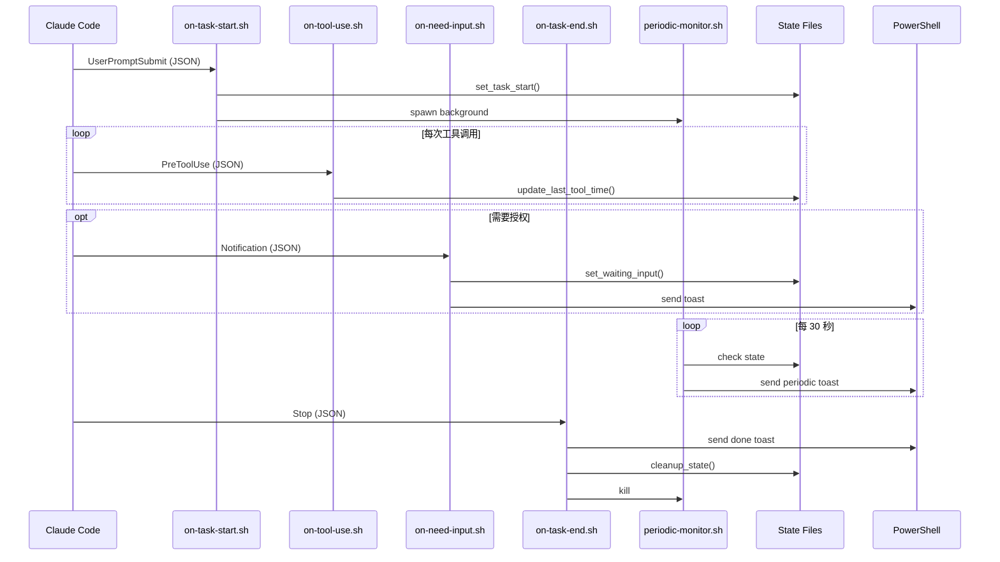

# C4 代码级文档：hooks/

## 概览

- **名称**：Claude Code Hook 脚本
- **描述**：与 Claude Code 的 hook 系统集成的事件处理脚本
- **位置**：[hooks/](../../../hooks/)
- **语言**：Bash（Shell 脚本）
- **用途**：响应 Claude Code 生命周期事件（任务开始、工具使用、需要输入、任务结束），触发通知并管理状态

## 代码元素

### on-task-start.sh

**位置**：[hooks/on-task-start.sh](../../../hooks/on-task-start.sh)

**Hook 类型**：`UserPromptSubmit`

**用途**：当用户向 Claude Code 提交提示词时调用。初始化任务状态并启动后台监控。

| 函数/部分 | 说明 |
|----------|------|
| 输入解析 | 从 stdin 读取 JSON，并用 `validate_json` 校验 |
| 会话 ID 提取 | 从 JSON 输入中解析 `session_id` |
| 状态初始化 | 调用 `set_task_start()` 记录开始时间、提示词、tmux 信息 |
| HWND 获取 | 通过 PowerShell 捕获 Windows Terminal 窗口句柄 |
| 监控启动 | 以后台进程启动 `periodic-monitor.sh` |

**流程**：

```txt
stdin（JSON）→ validate_json → parse_session_id → set_task_start
                                                 → capture HWND
                                                 → start periodic-monitor.sh
```

**安全特性**：

- SEC-2026-0112-0409 H2：输入校验
- SEC-2026-0112-0409 H3：用于 HWND 捕获的 Add-Type 保护
- SEC-2026-0112-0409 M3：快速失败（fail-fast）的 JSON 校验

### on-tool-use.sh

**位置**：[hooks/on-tool-use.sh](../../../hooks/on-tool-use.sh)

**Hook 类型**：`PreToolUse`

**用途**：在每次工具调用前触发。清除等待输入状态并更新活动时间戳。

| 函数/部分 | 说明 |
|----------|------|
| 输入解析 | 从 stdin 读取 JSON，并校验结构 |
| 会话 ID 提取 | 从 JSON 中解析 `session_id` |
| 状态更新 | 若已设置则清除 `waiting-input` 标志 |
| 活动跟踪 | 更新 `last-tool-time` 时间戳 |

**流程**：

```txt
stdin（JSON）→ validate_json → parse_session_id → clear_waiting_input
                                                → update_last_tool_time
```

**安全特性**：

- SEC-2026-0112-0409 H2：输入校验
- SEC-2026-0112-0409 M3：快速失败（fail-fast）的 JSON 校验

### on-need-input.sh

**位置**：[hooks/on-need-input.sh](../../../hooks/on-need-input.sh)

**Hook 类型**：`Notification`（匹配器：`permission_prompt|elicitation_dialog`）

**用途**：当 Claude Code 需要用户授权或输入时调用。发送即时通知。

| 函数/部分 | 说明 |
|----------|------|
| 输入解析 | 从 stdin 读取 JSON，并校验结构 |
| 重复检查 | 若已处于等待状态则跳过 |
| 状态更新 | 设置 `waiting-input` 标志 |
| 抑制判断 | 检查用户是否正在查看该 pane |
| 通知 | 通过 PowerShell 发送 "need_input" toast |

**流程**：

```txt
stdin（JSON）→ validate_json → parse_session_id → is_waiting_input?
                                                → set_waiting_input
                                                → should_suppress?
                                                → send_notification("need_input")
```

**安全特性**：

- SEC-2026-0112-0409 H1：使用 Base64 安全传参
- SEC-2026-0112-0409 H2：输入校验
- SEC-2026-0112-0409 M2：可配置的执行策略
- SEC-2026-0112-0409 M3：快速失败（fail-fast）的 JSON 校验

### on-task-end.sh

**位置**：[hooks/on-task-end.sh](../../../hooks/on-task-end.sh)

**Hook 类型**：`Stop`

**用途**：当 Claude Code 任务完成时调用。发送完成通知并清理状态。

| 函数/部分 | 说明 |
|----------|------|
| 输入解析 | 从 stdin 读取 JSON，并校验结构 |
| 任务检查 | 验证任务确实处于运行中 |
| 信息收集 | 获取耗时、提示词、会话名 |
| 抑制判断 | 检查用户是否正在查看该 pane |
| 通知 | 发送带主图（hero image）的 "done" toast |
| 清理 | 删除状态目录并停止监控进程 |

**流程**：

```txt
stdin（JSON）→ validate_json → parse_session_id → is_task_running?
                                                → get_elapsed_minutes
                                                → should_suppress?
                                                → send_notification("done")
                                                → cleanup_state
```

**安全特性**：

- SEC-2026-0112-0409 H1：使用 Base64 安全传参
- SEC-2026-0112-0409 H2：输入校验
- SEC-2026-0112-0409 M2：可配置的执行策略
- SEC-2026-0112-0409 M3：快速失败（fail-fast）的 JSON 校验

## 依赖

### 内部依赖

所有 hooks 依赖于：

- `config.sh` - 配置加载
- `lib/state.sh` - 状态管理
- `lib/json.sh` - JSON 解析
- `lib/log.sh` - 调试日志

额外依赖：

- `on-task-start.sh` → `lib/pwsh.sh`、`lib/audit.sh`
- `on-need-input.sh` → `lib/suppress.sh`、`lib/pwsh.sh`、`lib/sanitize.sh`
- `on-task-end.sh` → `lib/suppress.sh`、`lib/pwsh.sh`、`lib/sanitize.sh`、`lib/audit.sh`

### 外部依赖

- Claude Code hook 系统（通过 stdin 提供 JSON 输入）
- tmux（用于 pane/session 信息）
- PowerShell 7（用于 Windows 通知）

## 关系



## Hook 配置

Hooks 在 `~/.claude/settings.json` 中配置：

```json
{
  "hooks": {
    "UserPromptSubmit": [
      { "hooks": [{ "type": "command", "command": "/path/to/hooks/on-task-start.sh" }] }
    ],
    "Notification": [
      { "matcher": "permission_prompt|elicitation_dialog",
        "hooks": [{ "type": "command", "command": "/path/to/hooks/on-need-input.sh" }] }
    ],
    "PreToolUse": [
      { "hooks": [{ "type": "command", "command": "/path/to/hooks/on-tool-use.sh" }] }
    ],
    "Stop": [
      { "hooks": [{ "type": "command", "command": "/path/to/hooks/on-task-end.sh" }] }
    ]
  }
}
```
