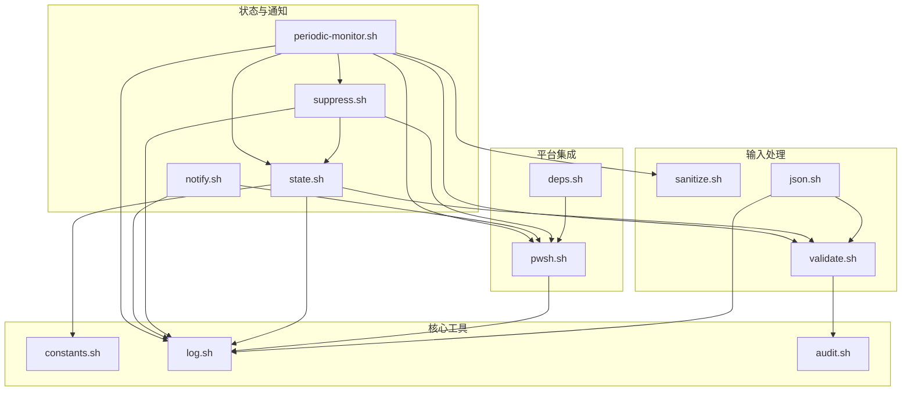

# C4 代码级文档：lib/

## 概述

- **名称**：核心库模块
- **描述**：为通知系统提供核心功能的共享工具模块
- **位置**：[lib/](../../../lib/)
- **语言**：Bash（Shell 脚本）
- **用途**：提供可复用函数，用于状态管理、发送通知、输入校验、日志记录，以及跨平台 PowerShell 集成

## 代码元素

### constants.sh

**位置**：[lib/constants.sh](../../../lib/constants.sh)

| 函数/变量 | 类型 | 说明 |
|-------------------|------|-------------|
| `CC_NOTIFY_VERSION` | 变量 | 版本字符串 "1.0.0" |
| `STATE_BASE_DIR` | 变量 | 状态文件的基础目录（`$XDG_CACHE_HOME/cc-notify`） |
| `DEFAULT_CHECK_INTERVAL` | 变量 | 后台监控检查间隔（30 秒） |
| `DEFAULT_RUNNING_INTERVAL` | 变量 | 周期性通知间隔（5 分钟） |
| `DEFAULT_PROMPT_MAX_CHARS` | 变量 | 提示词显示最大字符数（60） |
| `DEFAULT_SOUND_*` | 变量 | 默认的 Windows 声音文件路径 |

### state.sh

**位置**：[lib/state.sh](../../../lib/state.sh)

| 函数 | 签名 | 说明 |
|----------|-----------|-------------|
| `atomic_write` | `atomic_write(file, content)` | 使用 mktemp 进行原子写入，防止竞态条件 |
| `get_state_dir` | `get_state_dir(session_id) -> path` | 带校验地获取状态目录路径 |
| `init_state` | `init_state(session_id) -> path` | 以安全权限（700）初始化状态目录 |
| `cleanup_state` | `cleanup_state(session_id)` | 清理状态目录并终止监控进程 |
| `set_task_start` | `set_task_start(session_id, user_prompt)` | 记录任务开始时间、提示词和 tmux 信息 |
| `get_task_start_time` | `get_task_start_time(session_id) -> timestamp` | 获取任务开始的 Unix 时间戳 |
| `get_user_prompt` | `get_user_prompt(session_id) -> string` | 获取存储的用户提示词 |
| `get_tmux_info` | `get_tmux_info(session_id) -> string` | 获取 tmux session:window:pane 信息 |
| `get_tmux_session_name` | `get_tmux_session_name(session_id) -> string` | 提取 tmux 会话名称 |
| `set_waiting_input` | `set_waiting_input(session_id)` | 将任务标记为等待用户输入 |
| `clear_waiting_input` | `clear_waiting_input(session_id)` | 清除等待输入状态 |
| `is_waiting_input` | `is_waiting_input(session_id) -> bool` | 检查是否正在等待输入 |
| `is_task_running` | `is_task_running(session_id) -> bool` | 检查任务是否在运行 |
| `get_last_periodic_time` | `get_last_periodic_time(session_id) -> timestamp` | 获取上次周期性通知的时间 |
| `update_last_periodic_time` | `update_last_periodic_time(session_id)` | 更新周期性通知时间戳 |
| `set_monitor_pid` | `set_monitor_pid(session_id, pid)` | 保存后台监控进程 PID |
| `get_monitor_pid` | `get_monitor_pid(session_id) -> pid` | 获取后台监控进程 PID |
| `set_wt_hwnd` | `set_wt_hwnd(session_id, hwnd)` | 保存 Windows Terminal 窗口句柄 |
| `get_wt_hwnd` | `get_wt_hwnd(session_id) -> hwnd` | 获取 Windows Terminal 窗口句柄 |
| `update_last_tool_time` | `update_last_tool_time(session_id)` | 更新最后一次工具使用时间戳 |
| `get_last_tool_time` | `get_last_tool_time(session_id) -> timestamp` | 获取最后一次工具使用时间戳 |
| `get_elapsed_minutes` | `get_elapsed_minutes(session_id) -> int` | 计算自任务开始以来已过去的分钟数 |

### notify.sh

**位置**：[lib/notify.sh](../../../lib/notify.sh)

| 函数 | 签名 | 说明 |
|----------|-----------|-------------|
| `send_notification` | `send_notification(type, session_id, title, body, [options...])` | 通过 PowerShell 发送 Windows Toast 通知 |
| `build_tmux_info` | `build_tmux_info(session_id) -> string` | 构造用于点击聚焦的 tmux 信息字符串 |

**send_notification 的选项**：

- `-logo PATH` - 应用 Logo 图片路径
- `-hero PATH` - Hero 图片路径
- `-sound PATH` - 声音文件路径
- `-repeat N` - 声音重复次数
- `-update 0|1` - 更新同一条通知
- `-tmux INFO` - 点击动作使用的 tmux pane 信息

### pwsh.sh

**位置**：[lib/pwsh.sh](../../../lib/pwsh.sh)

| 函数 | 签名 | 说明 |
|----------|-----------|-------------|
| `get_execution_policy` | `get_execution_policy() -> string` | 获取配置的 PowerShell 执行策略（AllSigned/RemoteSigned/Bypass） |
| `find_pwsh` | `find_pwsh() -> path` | 带缓存地查找 PowerShell 可执行文件 |
| `require_pwsh` | `require_pwsh() -> path` | 获取 PowerShell 路径，否则退出并报错 |
| `has_pwsh` | `has_pwsh() -> bool` | 检查 PowerShell 是否可用 |

### suppress.sh

**位置**：[lib/suppress.sh](../../../lib/suppress.sh)

| 函数 | 签名 | 说明 |
|----------|-----------|-------------|
| `is_windows_terminal_foreground` | `is_windows_terminal_foreground() -> bool` | 检查 Windows Terminal 是否为前台窗口 |
| `get_active_client_info` | `get_active_client_info() -> string` | 获取最近活跃的 tmux client 信息 |
| `is_target_window_visible` | `is_target_window_visible(target_window) -> bool` | 检查目标 tmux window 是否可见 |
| `is_target_pane_visible` | `is_target_pane_visible(target_pane) -> bool` | 检查目标 tmux pane 是否可见（考虑缩放） |
| `should_suppress` | `should_suppress(session_id, [notify_type]) -> bool` | 主要抑制检查——若应抑制则返回 0 |

### periodic-monitor.sh

**位置**：[lib/periodic-monitor.sh](../../../lib/periodic-monitor.sh)

| 函数 | 签名 | 说明 |
|----------|-----------|-------------|
| `cleanup_on_exit` | `cleanup_on_exit()` | TERM/INT 信号处理器——清理并退出 |
| `send_periodic_notification` | `send_periodic_notification()` | 发送周期性“运行中”通知 |
| `main_loop` | `main_loop()` | 主监控循环：每 30 秒检查一次，并按配置间隔发送通知 |

**主循环逻辑**：

1. 休眠 CHECK_INTERVAL（30 秒）
2. 检查任务是否仍在运行
3. 检查 Claude Code 进程是否存在
4. 若等待输入则跳过
5. 若应抑制（用户正在查看 pane）则跳过
6. 若任务空闲（60 秒内无工具使用）则跳过
7. 若到达间隔则发送通知

### validate.sh

**位置**：[lib/validate.sh](../../../lib/validate.sh)

| 函数 | 签名 | 说明 |
|----------|-----------|-------------|
| `validate_session_id` | `validate_session_id(session_id) -> safe_id` | 校验 session_id 格式（字母数字，最长 64 字符，不允许路径穿越） |
| `validate_path_in_base` | `validate_path_in_base(path, base_dir) -> real_path` | 校验路径是否位于基础目录内 |
| `validate_tmux_pane` | `validate_tmux_pane(pane) -> safe_pane` | 校验 tmux pane 格式 |

### sanitize.sh

**位置**：[lib/sanitize.sh](../../../lib/sanitize.sh)

| 函数 | 签名 | 说明 |
|----------|-----------|-------------|
| `sanitize_display` | `sanitize_display(input, [max_len=200]) -> string` | 移除控制字符并限制长度 |
| `to_base64` | `to_base64(input) -> base64_string` | Base64 编码，用于安全传递 PowerShell 参数 |
| `validate_base64` | `validate_base64(input) -> bool` | 校验 Base64 格式 |
| `sanitize_for_shell` | `sanitize_for_shell(input) -> string` | 移除 shell 危险字符（备选方法） |
| `safe_encode_for_pwsh` | `safe_encode_for_pwsh(input, [max_len=200]) -> base64` | 清理后进行 Base64 编码，用于 PowerShell |

### json.sh

**位置**：[lib/json.sh](../../../lib/json.sh)

| 函数 | 签名 | 说明 |
|----------|-----------|-------------|
| `validate_json` | `validate_json(input) -> bool` | 使用 jq 或回退方案校验 JSON 结构 |
| `parse_session_id` | `parse_session_id(input) -> session_id` | 从 JSON 解析并校验 session_id |
| `parse_prompt` | `parse_prompt(input) -> prompt` | 解析 prompt 字段 |
| `parse_json_field` | `parse_json_field(input, field) -> value` | 解析 JSON 中任意字段 |

### log.sh

**位置**：[lib/log.sh](../../../lib/log.sh)

| 函数 | 签名 | 说明 |
|----------|-----------|-------------|
| `init_log` | `init_log()` | 以安全权限（600）初始化日志文件 |
| `sanitize_log_msg` | `sanitize_log_msg(msg, [max_len=1024]) -> string` | 清理日志消息（脱敏敏感数据） |
| `log_debug` | `log_debug(message)` | 记录 debug 消息（仅当 CC_NOTIFY_DEBUG=1 时） |
| `log_info` | `log_info(message)` | 记录 info 消息 |
| `log_error` | `log_error(message)` | 记录 error 消息 |
| `log_warn` | `log_warn(message)` | 记录 warn 消息 |
| `run_quiet` | `run_quiet(command...)` | 执行命令，在 debug 模式下捕获 stderr |

### audit.sh

**位置**：[lib/audit.sh](../../../lib/audit.sh)

| 函数 | 签名 | 说明 |
|----------|-----------|-------------|
| `init_audit` | `init_audit()` | 初始化审计日志文件 |
| `audit_log` | `audit_log(event, details)` | 以 JSONL 格式写入审计事件 |
| `audit_session_start` | `audit_session_start(session_id)` | 记录会话开始事件 |
| `audit_session_end` | `audit_session_end(session_id)` | 记录会话结束事件 |
| `audit_validation_failure` | `audit_validation_failure(field, reason)` | 记录校验失败 |
| `audit_notification_sent` | `audit_notification_sent(type)` | 记录已发送的通知 |
| `audit_rate_limited` | `audit_rate_limited(session_id)` | 记录限速事件 |
| `audit_permission_denied` | `audit_permission_denied(operation, resource)` | 记录权限拒绝 |

### deps.sh

**位置**：[lib/deps.sh](../../../lib/deps.sh)

| 函数 | 签名 | 说明 |
|----------|-----------|-------------|
| `detect_lang` | `detect_lang() -> "zh"|"en"` | 根据 locale 检测 UI 语言 |
| `has_command` | `has_command(cmd) -> bool` | 检查命令是否存在 |
| `check_dependencies` | `check_dependencies() -> missing_list` | 检查所有依赖并返回缺失列表 |
| `check_burnttoast` | `check_burnttoast() -> bool` | 检查是否已安装 BurntToast PowerShell 模块 |
| `print_dependency_status` | `print_dependency_status()` | 打印格式化的依赖状态 |
| `all_dependencies_met` | `all_dependencies_met() -> bool` | 检查是否满足所有依赖 |

## 依赖

### 内部依赖

- `constants.sh` → （无）
- `validate.sh` → `audit.sh`
- `log.sh` → （无）
- `audit.sh` → （无）
- `sanitize.sh` → （无）
- `json.sh` → `validate.sh`, `log.sh`
- `pwsh.sh` → `log.sh`
- `state.sh` → `constants.sh`, `validate.sh`, `log.sh`
- `suppress.sh` → `pwsh.sh`, `log.sh`, `state.sh`
- `notify.sh` → `pwsh.sh`, `log.sh`
- `periodic-monitor.sh` → `config.sh`, `state.sh`, `suppress.sh`, `pwsh.sh`, `log.sh`, `sanitize.sh`, `validate.sh`
- `deps.sh` → `pwsh.sh`

### 外部依赖

- `jq` - JSON 处理（可选，提供回退方案）
- `tmux` - 终端复用器
- `base64` - Base64 编码
- `realpath` - 路径规范化
- PowerShell 7（`pwsh.exe`）- Windows 通知 API

## 关系

