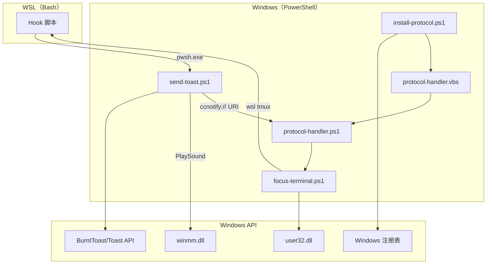
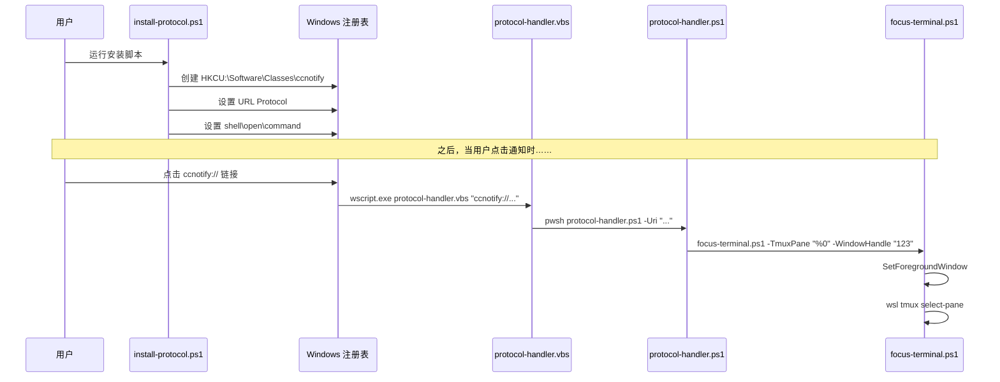

# C4 代码级文档：ps/

## 概览

- **名称**：PowerShell 脚本
- **描述**：Windows 侧用于 Toast 通知与窗口管理的脚本
- **位置**：[ps/](../../../ps/)
- **语言**：PowerShell 7
- **用途**：对接 Windows Toast API（BurntToast）、处理 URI 协议，并管理窗口焦点

## 代码元素

### send-toast.ps1

**位置**：[ps/send-toast.ps1](../../../ps/send-toast.ps1)

**用途**：主要的通知发送器——创建并显示 Windows Toast 通知。

| 参数 | 类型 | 说明 |
|-----------|------|-------------|
| `Type` | string | 通知类型："running"、"need_input"、"done"、"remove" |
| `SessionId` | string | 用于通知分组的会话标识符 |
| `Title` | string | 通知标题（纯文本） |
| `Body` | string | 通知正文（纯文本） |
| `TitleB64` | string | Base64 编码的标题（优先使用，SEC-2026-0112-0409 H1） |
| `BodyB64` | string | Base64 编码的正文（优先使用） |
| `TmuxInfoB64` | string | 用于点击动作的 Base64 编码 tmux 信息 |
| `AppLogo` | string | 应用图标图片路径 |
| `HeroImage` | string | Hero 图片路径（用于 "done" 类型） |
| `SoundPath` | string | 声音文件路径 |
| `SoundRepeat` | int | 播放声音的次数 |
| `UpdateSame` | string | "1" 表示更新已有通知 |
| `TmuxInfo` | string | 纯文本 tmux 信息（备用） |

| 函数 | 签名 | 说明 |
|----------|-----------|-------------|
| `Decode-Base64` | `Decode-Base64($Encoded) -> string` | 解码 Base64 UTF-8 字符串 |
| `Get-NotificationTag` | `Get-NotificationTag($Type, $SessionId) -> string` | 生成唯一通知标签（tag） |
| `Remove-Notification` | `Remove-Notification($Tag)` | 按标签移除通知 |
| `Send-Notification` | `Send-Notification(...)` | 构建并提交 Toast 通知 |

**通知类型**：

- `running` - 进度通知，更新同一个 toast
- `need_input` - 需要输入，每次创建新的 toast
- `done` - 完成通知（带 hero 图片），清除 `running` toast
- `remove` - 移除该会话的所有通知

**安全特性**：

- SEC-2026-0112-0409 H1：Base64 参数解码
- SEC-2026-0112-0409 H3：WinSound 的 Add-Type 幂等化

### focus-terminal.ps1

**位置**：[ps/focus-terminal.ps1](../../../ps/focus-terminal.ps1)

**用途**：聚焦 Windows Terminal 窗口并切换到目标 tmux pane。

| 参数 | 类型 | 说明 |
|-----------|------|-------------|
| `TmuxPane` | string | 目标 tmux pane ID（例如 "%0"） |
| `WindowHandle` | string | Windows Terminal 的 HWND |

| Win32 API | 说明 |
|-----------|-------------|
| `SetForegroundWindow` | 将窗口置于前台 |
| `ShowWindow` | 恢复最小化窗口 |
| `IsIconic` | 检查窗口是否最小化 |
| `IsWindow` | 校验窗口句柄有效性 |
| `GetForegroundWindow` | 获取当前前台窗口 |
| `GetWindowThreadProcessId` | 获取窗口所属线程/进程 ID |
| `GetCurrentThreadId` | 获取当前线程 ID |
| `AttachThreadInput` | 附加线程输入以绕过焦点限制 |
| `BringWindowToTop` | 将窗口提升到 Z-order 顶部 |

**流程**：

1. 校验/查找窗口句柄
2. 如已最小化则恢复
3. 使用 AttachThreadInput 绕过前台窗口限制
4. 设置为前台窗口
5. 通过 WSL 切换 tmux pane

### protocol-handler.ps1

**位置**：[ps/protocol-handler.ps1](../../../ps/protocol-handler.ps1)

**用途**：处理 `ccnotify://` URI 协议——解析 URI 并调用 focus-terminal.ps1。

| 参数 | 类型 | 说明 |
|-----------|------|-------------|
| `Uri` | string | 完整 URI（例如 "ccnotify://%0:12345"） |

| 函数 | 签名 | 说明 |
|----------|-----------|-------------|
| `Validate-TmuxPane` | `Validate-TmuxPane($Pane) -> string|null` | 校验 tmux pane 格式 |

**URI 格式**：`ccnotify://{pane_id}:{hwnd}`

**安全特性**：

- SEC-2026-0112-0409 H4：TmuxPane 格式校验（防止注入）

### install-protocol.ps1

**位置**：[ps/install-protocol.ps1](../../../ps/install-protocol.ps1)

**用途**：在 Windows 注册表中注册 `ccnotify://` URI 协议。

| 参数 | 类型 | 说明 |
|-----------|------|-------------|
| `-Force` | switch | 跳过确认提示 |
| `-Uninstall` | switch | 移除协议注册 |
| `-Lang` | string | UI 语言（"zh" 或 "en"） |

| 函数 | 签名 | 说明 |
|----------|-----------|-------------|
| `Get-UILang` | `Get-UILang() -> string` | 从系统区域设置检测 UI 语言 |
| `Find-PowerShell` | `Find-PowerShell() -> path` | 查找 PowerShell 7 可执行文件 |

**注册表路径**：`HKCU:\Software\Classes\ccnotify`

**安全特性**：

- SEC-2026-0112-0409 M4：路径校验、用户确认、支持卸载

### install-protocol-local.ps1

**位置**：[ps/install-protocol-local.ps1](../../../ps/install-protocol-local.ps1)

**用途**：用于自动安装的 install-protocol.ps1 非交互版本。

与 `install-protocol.ps1` 类似，但默认启用 `-Force` 行为。

## 依赖

### 内部依赖

- `send-toast.ps1` → `focus-terminal.ps1`（通过 URI 协议）
- `protocol-handler.ps1` → `focus-terminal.ps1`
- `install-protocol.ps1` → `protocol-handler.vbs`

### 外部依赖

- **BurntToast** - 用于 Windows Toast 通知的 PowerShell 模块
- **Windows API** (user32.dll, winmm.dll, kernel32.dll)
- **WSL** - 用于切换 tmux pane

## 关系

## 协议注册流程

