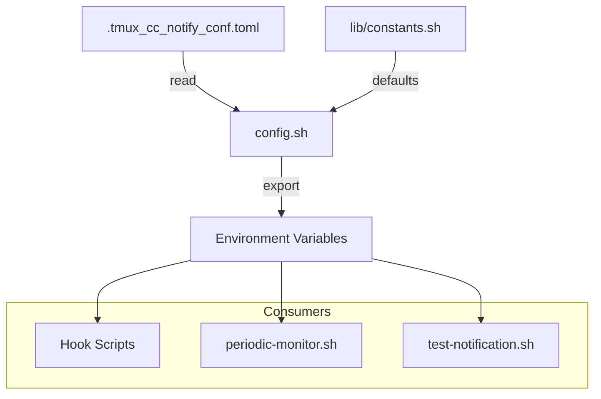

# C4 代码级文档：根配置

## 概述

- **名称**：根配置模块
- **描述**：主配置加载器与 TOML 解析器
- **位置**：[config.sh](../../../config.sh)
- **语言**：Bash（Shell 脚本）
- **目的**：加载并解析 TOML 配置文件，为配置项提供带默认值的读取能力

## 代码元素

### config.sh

**位置**：[config.sh](../../../config.sh)

| 函数 | 签名 | 说明 |
|----------|-----------|-------------|
| `get_config` | `get_config(section, key, default) -> value` | 从 TOML 获取字符串配置值 |
| `get_config_bool` | `get_config_bool(section, key, default) -> "0"|"1"` | 获取布尔配置值 |
| `get_config_int` | `get_config_int(section, key, default) -> int` | 获取整数配置值 |
| `load_all_config` | `load_all_config()` | 将所有配置加载到环境变量 |
| `validate_config_bounds` | `validate_config_bounds()` | 校验配置值是否在范围内 |

**配置文件**：`.tmux_cc_notify_conf.toml`

**由 `load_all_config()` 设置的环境变量**：

| 变量 | Section.Key | 默认值 | 说明 |
|----------|-------------|---------|-------------|
| `CC_NOTIFY_APP_LOGO` | assets.app_logo | "" | App Logo 图片路径 |
| `CC_NOTIFY_HERO_IMAGE` | assets.hero_image_task_end | "" | Hero 图片路径 |
| `CC_NOTIFY_TITLE_TPL` | text.title | "{session} Claude Code" | 标题模板 |
| `CC_NOTIFY_RUNNING_BODY_TPL` | text.running_body | "[Running: {mm} min] {prompt}" | 运行中正文模板 |
| `CC_NOTIFY_DONE_BODY_TPL` | text.done_body | "[Total: {mm} min] {prompt}" | 完成正文模板 |
| `CC_NOTIFY_NEED_INPUT_BODY` | text.need_input_body | "Permission/input required" | 需要输入时的正文文本 |
| `CC_NOTIFY_PROMPT_MAX_CHARS` | text.prompt_max_chars | 60 | Prompt 展示的最大字符数 |
| `CC_NOTIFY_RUNNING_ENABLED` | running.enabled | 1 | 启用定时通知 |
| `CC_NOTIFY_RUNNING_INTERVAL` | running.interval_minutes | 5 | 通知间隔（分钟） |
| `CC_NOTIFY_RUNNING_SOUND` | running.sound_path | "C:\Windows\Media\chimes.wav" | 运行中提示音文件 |
| `CC_NOTIFY_RUNNING_SOUND_REPEAT` | running.sound_repeat | 1 | 提示音重复次数 |
| `CC_NOTIFY_RUNNING_UPDATE_SAME` | running.update_same_toast | 1 | 更新同一条 Toast |
| `CC_NOTIFY_NEED_INPUT_ENABLED` | need_input.enabled | 1 | 启用需要输入的通知 |
| `CC_NOTIFY_NEED_INPUT_SOUND` | need_input.sound_path | "C:\Windows\Media\notify.wav" | 需要输入提示音文件 |
| `CC_NOTIFY_NEED_INPUT_SOUND_REPEAT` | need_input.sound_repeat | 2 | 提示音重复次数 |
| `CC_NOTIFY_DONE_ENABLED` | done.enabled | 1 | 启用完成通知 |
| `CC_NOTIFY_DONE_SOUND` | done.sound_path | "C:\Windows\Media\tada.wav" | 完成提示音文件 |
| `CC_NOTIFY_DONE_SOUND_REPEAT` | done.sound_repeat | 1 | 提示音重复次数 |
| `CC_NOTIFY_SUPPRESS_ENABLED` | suppress.enabled | 1 | 启用抑制（suppress）功能 |
| `CC_NOTIFY_SUPPRESS_NEED_INPUT` | suppress.need_input | 1 | 抑制需要输入通知 |
| `CC_NOTIFY_SUPPRESS_RUNNING` | suppress.running | 1 | 抑制运行中通知 |
| `CC_NOTIFY_SUPPRESS_DONE` | suppress.done | 1 | 抑制完成通知 |
| `CC_NOTIFY_PWSH_EXECUTION_POLICY` | security.pwsh_execution_policy | "RemoteSigned" | PowerShell 执行策略 |
| `CC_NOTIFY_PWSH_PATH` | system.pwsh_path | "" | 自定义 PowerShell 路径 |

**边界校验**（SEC-2026-0112-0409 L3）：

- `prompt_max_chars`：10-500
- `running_interval`：1-60 分钟
- `sound_repeat`：1-10

## TOML 解析器

`get_config` 函数实现了一个简单的 TOML 解析器：

1. 跳过空行与注释（`#`）
2. 跟踪当前 section（`[section]`）
3. 在目标 section 内匹配 `key = value`
4. 去除行内注释
5. 去掉值的引号
6. 处理 TOML 转义序列（`\\` → `\`）

## 配置文件格式

```toml
[assets]
# 可选：自定义 App Logo 与 Hero 图片
# app_logo = "C:\\path\\to\\logo.png"
# hero_image_task_end = "C:\\path\\to\\hero.png"

[text]
title = "{session} Claude Code"
running_body = "[Running: {mm} min] {prompt}"
done_body = "[Total: {mm} min] {prompt}"
need_input_body = "Permission/input required"
prompt_max_chars = 60

[running]
enabled = true
interval_minutes = 5
sound_path = "C:\\Windows\\Media\\chimes.wav"
sound_repeat = 1

[need_input]
enabled = true
sound_path = "C:\\Windows\\Media\\notify.wav"
sound_repeat = 2

[done]
enabled = true
sound_path = "C:\\Windows\\Media\\tada.wav"
sound_repeat = 1

[suppress]
enabled = true
need_input = true
running = true
done = true

[security]
pwsh_execution_policy = "RemoteSigned"

[system]
# pwsh_path = "/custom/path/to/pwsh.exe"
```

## 模板变量

| 变量 | 说明 |
|----------|-------------|
| `{session}` | tmux 会话名 |
| `{mm}` | 已用分钟数 |
| `{prompt}` | 用户输入（截断后） |

## 依赖

### 内部依赖

- `lib/constants.sh` - 默认值

### 外部依赖

- 无（纯 Bash）

## 关系


