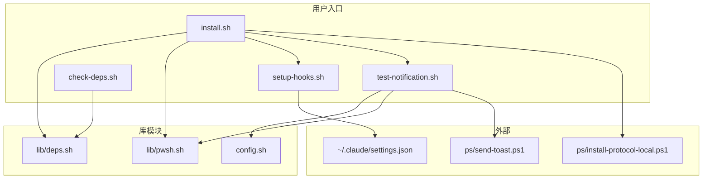

# C4 代码级文档：scripts/

## 概述

- **名称**：安装与测试脚本
- **描述**：面向用户的安装、配置与测试脚本
- **位置**：[scripts/](../../../scripts/)
- **语言**：Bash（Shell 脚本）
- **用途**：提供便捷的一键安装、Hook 配置、依赖检查与通知测试

## 代码元素

### install.sh

**位置**：[scripts/install.sh](../../../scripts/install.sh)

**用途**：一键安装脚本，用于搭建整个通知系统。

| 函数 | 签名 | 说明 |
|----------|-----------|-------------|
| `detect_lang` | `detect_lang() -> "zh"|"en"` | 从 locale/Windows 检测 UI 语言 |
| `print_step` | `print_step(message)` | 打印绿色步骤提示 |
| `print_warn` | `print_warn(message)` | 打印黄色警告 |
| `print_error` | `print_error(message)` | 打印红色错误 |

**安装步骤**：

1. 检查依赖（jq、tmux、PowerShell、BurntToast、wslpath）
2. 若配置不存在则复制配置模板
3. 注册 `ccnotify://` URI 协议
4. 配置 Claude Code hooks
5. 发送测试通知

**参数**：

- `--lang zh|en` - 强制指定 UI 语言

### setup-hooks.sh

**位置**：[scripts/setup-hooks.sh](../../../scripts/setup-hooks.sh)

**用途**：在 `~/.claude/settings.json` 中配置 Claude Code hooks。

| 函数 | 签名 | 说明 |
|----------|-----------|-------------|
| `detect_lang` | `detect_lang() -> "zh"|"en"` | 检测 UI 语言 |
| `generate_hooks_json` | `generate_hooks_json() -> json` | 生成 hooks 配置 JSON |
| `print_hooks_config` | `print_hooks_config()` | 输出 hooks 配置，便于手动复制 |
| `print_info` | `print_info(message)` | 打印信息消息 |
| `print_warn` | `print_warn(message)` | 打印警告消息 |

**配置方式**：

1. **使用 jq**：将 hooks 深度合并到现有 settings 中
2. **不使用 jq（回退方案）**：
   - 若文件不存在则创建新文件
   - 若不存在 hooks 配置则插入 hooks
   - 若已存在 hooks 配置则输出手动操作说明

**生成的 Hook 事件**：

- `UserPromptSubmit` → `on-task-start.sh`
- `Notification`（matcher：`permission_prompt|elicitation_dialog`）→ `on-need-input.sh`
- `PreToolUse` → `on-tool-use.sh`
- `Stop` → `on-task-end.sh`

### check-deps.sh

**位置**：[scripts/check-deps.sh](../../../scripts/check-deps.sh)

**用途**：检查并展示依赖状态。

仅负责 source `lib/deps.sh` 并调用 `print_dependency_status()`。

**检查的依赖项**：

- jq（JSON 处理器）
- tmux（终端复用器）
- PowerShell 7（pwsh.exe）
- BurntToast（PowerShell 模块）
- wslpath（WSL 工具）

### test-notification.sh

**位置**：[scripts/test-notification.sh](../../../scripts/test-notification.sh)

**用途**：测试通知功能。

| 参数 | 说明 |
|----------|-------------|
| `all` | 测试所有通知类型 |
| `running` | 测试周期性/运行中通知 |
| `input` | 测试需要输入通知 |
| `done` | 测试完成通知 |
| `click` | 测试点击聚焦功能 |
| `cleanup` | 移除所有测试通知 |

**测试流程**：

1. 生成测试会话 ID
2. 加载配置
3. 通过 PowerShell 发送通知
4. 展示结果

## 依赖

### 内部依赖

- `install.sh` → `lib/deps.sh`、`lib/pwsh.sh`、`setup-hooks.sh`、`test-notification.sh`
- `setup-hooks.sh` →（无，脚本自包含）
- `check-deps.sh` → `lib/deps.sh`
- `test-notification.sh` → `config.sh`、`lib/pwsh.sh`

### 外部依赖

- jq（setup-hooks.sh 可选）
- PowerShell 7
- BurntToast 模块
- wslpath

## 关系



## 使用示例

```bash
# 完整安装
./scripts/install.sh

# 仅检查依赖
./scripts/check-deps.sh

# 仅配置 hooks
./scripts/setup-hooks.sh

# 测试所有通知
./scripts/test-notification.sh all

# 测试指定类型的通知
./scripts/test-notification.sh done

# 清理测试通知
./scripts/test-notification.sh cleanup
```
