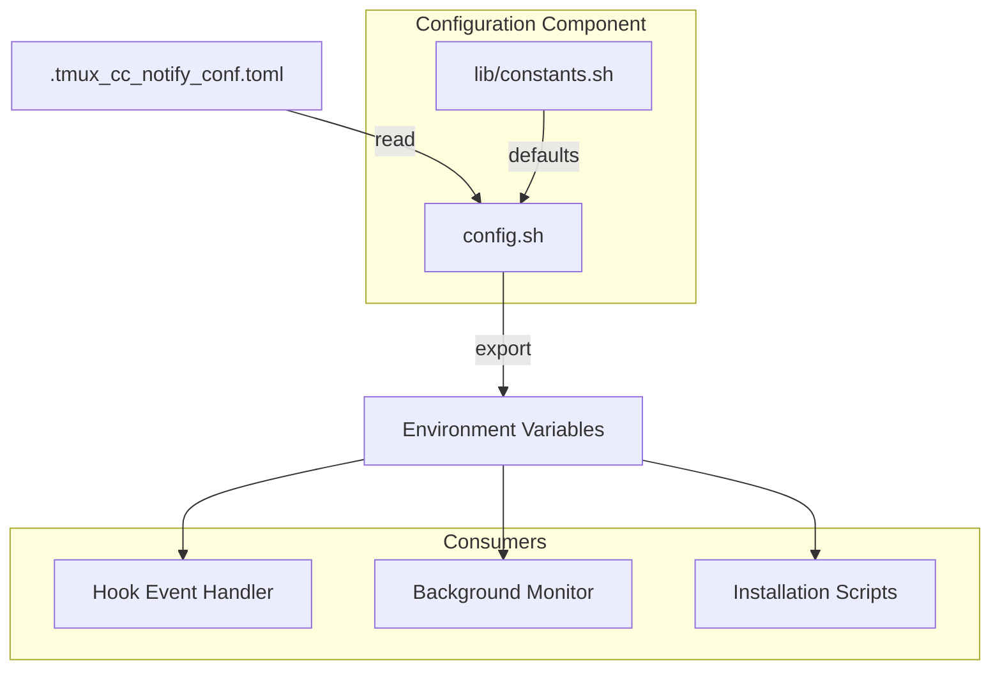

# C4 组件：配置

## 概览

- **名称**：配置
- **描述**：管理应用配置与用户偏好设置
- **类型**：库组件
- **技术**：Bash Shell 脚本、TOML

## 目的

配置组件提供一种集中式方式来管理所有通知设置。它解析 TOML 配置文件，并将设置以环境变量的形式提供给其他组件使用。

**关键职责**：

- 解析 TOML 配置文件
- 为所有设置提供默认值
- 校验配置值范围
- 将设置导出为环境变量

## 软件特性

| 功能 | 描述 |
|---------|-------------|
| TOML 解析 | 从 `.tmux_cc_notify_conf.toml` 解析配置 |
| 默认值 | 为所有设置提供合理的默认值 |
| 类型转换 | 支持布尔、整数与字符串类型的配置 |
| 边界校验 | 确保取值在可接受范围内 |
| 环境变量导出 | 将所有设置导出为 `CC_NOTIFY_*` 变量 |

## 代码要素

本组件包含以下代码级文档：

- [c4-code-root.md](c4-code-root.md) - 配置加载器（config.sh）
- [c4-code-lib.md](c4-code-lib.md) - 常量（lib/constants.sh）

## 接口

### 输入接口：配置文件

**文件**：`.tmux_cc_notify_conf.toml`

| Section | Keys | 描述 |
|---------|------|-------------|
| `[assets]` | app_logo, hero_image_task_end | 图片路径 |
| `[text]` | title, running_body, done_body, need_input_body, prompt_max_chars | 文本模板 |
| `[running]` | enabled, interval_minutes, sound_path, sound_repeat, update_same_toast | 运行中通知设置 |
| `[need_input]` | enabled, sound_path, sound_repeat | 需要输入通知设置 |
| `[done]` | enabled, sound_path, sound_repeat | 完成通知设置 |
| `[suppress]` | enabled, need_input, running, done | 抑制（suppress）设置 |
| `[security]` | pwsh_execution_policy | 安全设置 |
| `[system]` | pwsh_path | 系统路径 |

### 输出接口：环境变量

| 变量 | 类型 | 描述 |
|----------|------|-------------|
| `CC_NOTIFY_APP_LOGO` | string | App Logo 路径 |
| `CC_NOTIFY_HERO_IMAGE` | string | Hero 图片路径 |
| `CC_NOTIFY_TITLE_TPL` | string | 标题模板 |
| `CC_NOTIFY_RUNNING_*` | various | 运行中通知设置 |
| `CC_NOTIFY_NEED_INPUT_*` | various | 需要输入通知设置 |
| `CC_NOTIFY_DONE_*` | various | 完成通知设置 |
| `CC_NOTIFY_SUPPRESS_*` | bool | 抑制标志 |
| `CC_NOTIFY_PWSH_*` | string | PowerShell 设置 |

### API 函数

| 函数 | 签名 | 描述 |
|----------|-----------|-------------|
| `get_config` | `(section, key, default) -> string` | 获取配置值 |
| `get_config_bool` | `(section, key, default) -> "0"|"1"` | 获取布尔配置 |
| `get_config_int` | `(section, key, default) -> int` | 获取整数配置 |
| `load_all_config` | `()` | 将所有配置加载到环境变量 |

## 依赖

### 使用的组件

- 无（叶子组件）

### 外部系统

- 文件系统（配置文件）

## 组件图

## 配置章节

### 文本模板

模板支持以下变量：

- `{session}` - tmux 会话名
- `{mm}` - 已用分钟数
- `{prompt}` - 用户输入（截断后）

### 边界校验

| 设置项 | 最小值 | 最大值 | 默认值 |
|---------|-----|-----|---------|
| prompt_max_chars | 10 | 500 | 60 |
| interval_minutes | 1 | 60 | 5 |
| sound_repeat | 1 | 10 | 1-2 |

## 安全性考虑

- **SEC-2026-0112-0409 L3**：配置值范围校验
- **SEC-2026-0112-0409 M2**：PowerShell 执行策略配置
- **SEC-2026-0112-0409 L2**：支持自定义 PowerShell 路径
