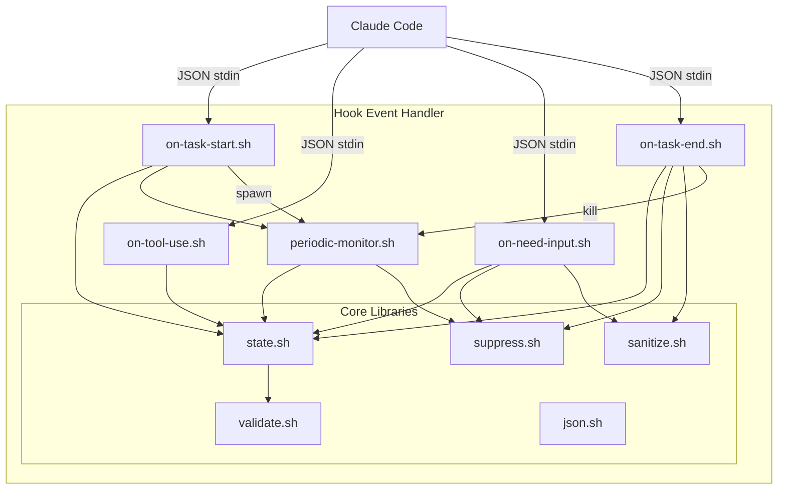

# C4 组件：Hook 事件处理器

## 概览

- **名称**：Hook 事件处理器
- **描述**：处理 Claude Code 生命周期事件并触发相应通知
- **类型**：应用组件
- **技术**：Bash Shell 脚本

## 目的

Hook 事件处理器组件接收来自 Claude Code Hook 系统的事件，并编排通知工作流。它作为 Claude Code 与 Windows 通知系统之间的桥梁。

**关键职责**：

- 解析并校验来自 Claude Code Hooks 的 JSON 输入
- 管理任务状态（开始、运行中、等待中、完成）
- 判断何时发送通知或抑制通知
- 与 Windows 通知组件协调配合

## 软件特性

| 功能 | 描述 |
|---------|-------------|
| 任务生命周期跟踪 | 跟踪任务开始、工具使用、输入请求与完成 |
| 状态持久化 | 在多次 Hook 调用之间维护任务状态 |
| 输入校验 | 校验所有输入以防止注入攻击 |
| 抑制逻辑 | 当用户正在查看任务面板时跳过通知 |
| 后台监控 | 定期检查长时间运行的任务 |

## 代码要素

本组件包含以下代码级文档：

- [c4-code-hooks.md](c4-code-hooks.md) - Hook 脚本实现
- [c4-code-lib.md](c4-code-lib.md) - 核心库模块（state、suppress、validate、json）

## 接口

### 输入接口：Claude Code Hooks

| 事件 | 触发时机 | JSON 字段 |
|-------|---------|-------------|
| `UserPromptSubmit` | 用户提交提示词 | `session_id`, `prompt` |
| `PreToolUse` | 工具执行前 | `session_id`, `tool_name` |
| `Notification` | 需要权限/输入 | `session_id`, `type` |
| `Stop` | 任务完成 | `session_id` |

### 输出接口：通知请求

| 操作 | 参数 | 描述 |
|-----------|------------|-------------|
| `send_notification` | type, session_id, title, body, options | 请求发送 Toast 通知 |
| `state_update` | session_id, state_data | 更新持久化状态 |

## 依赖

### 使用的组件

- **Windows 通知组件** - 用于发送 Toast 通知
- **配置组件** - 用于通知设置

### 外部系统

- **Claude Code** - 通过 stdin 的 JSON 提供 Hook 事件
- **tmux** - 提供会话/窗格信息
- **文件系统** - 在 `$XDG_CACHE_HOME/cc-notify/` 中持久化状态

## 组件图

## 安全性考虑

- **SEC-2026-0112-0409 H1**：对 PowerShell 参数进行 Base64 编码
- **SEC-2026-0112-0409 H2**：会话 ID 校验（仅字母数字，禁止路径穿越）
- **SEC-2026-0112-0409 M3**：快速失败的 JSON 校验
- **SEC-2026-0112-0409 M5**：在终止进程前验证 PID 的归属
