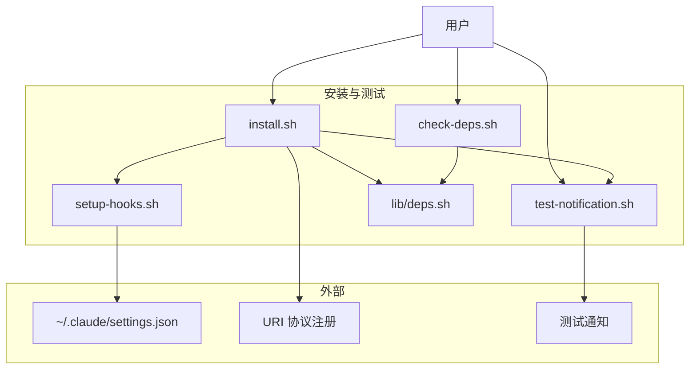
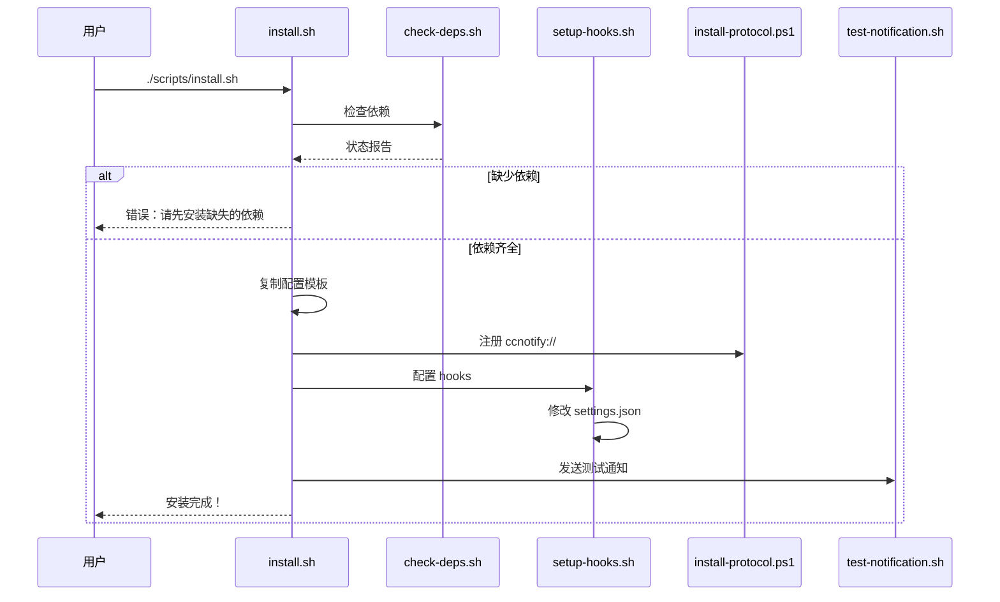

# C4 组件：安装与测试

## 概览

- **名称**：安装与测试
- **描述**：面向用户的安装、配置与验证脚本
- **类型**：工具组件
- **技术**：Bash Shell 脚本

## 目的

安装与测试组件提供面向用户的脚本，用于安装、配置并测试通知系统。它负责依赖检查、Hook 配置以及通知测试。

**关键职责**：

- 检查并报告依赖状态
- 安装并配置通知系统
- 配置 Claude Code hooks
- 测试通知功能

## 软件特性

| 功能 | 描述 |
|---------|-------------|
| 依赖检查 | 验证所有必需工具已安装 |
| 一键安装 | 单条命令完成完整设置 |
| Hook 配置 | 自动配置 Claude Code 的 settings.json |
| 通知测试 | 测试所有通知类型 |
| 多语言支持 | 支持英文与中文 UI |

## 代码要素

本组件包含以下代码级文档：

- [c4-code-scripts.md](c4-code-scripts.md) - 安装与测试脚本
- [c4-code-lib.md](c4-code-lib.md) - 依赖检查（lib/deps.sh）

## 接口

### CLI 接口：install.sh

```bash
./scripts/install.sh [--lang zh|en]
```

**步骤**：

1. 检查依赖
2. 复制配置模板
3. 注册 URI 协议
4. 配置 Claude Code hooks
5. 发送测试通知

### CLI 接口：setup-hooks.sh

```bash
./scripts/setup-hooks.sh
```

**输出**：修改 `~/.claude/settings.json`

### CLI 接口：check-deps.sh

```bash
./scripts/check-deps.sh
```

**输出**：依赖状态报告

### CLI 接口：test-notification.sh

```bash
./scripts/test-notification.sh [all|running|input|done|click|cleanup]
```

**参数**：

- `all` - 测试所有通知类型
- `running` - 测试周期性/运行中通知
- `input` - 测试需要输入的通知
- `done` - 测试完成通知
- `click` - 测试点击聚焦功能
- `cleanup` - 移除所有测试通知

## 依赖

### 使用的组件

- **配置组件** - 用于加载设置
- **Windows 通知组件** - 用于发送测试通知

### 外部系统

- **Claude Code** - Hook 配置目标
- **PowerShell** - 用于协议注册
- **jq** - JSON 处理（可选）

## 组件图



## 安装流程



## 依赖要求

| 依赖项 | 必需 | 用途 |
|--------|------|------|
| jq | 建议 | JSON 处理 |
| tmux | 必需 | 终端复用器 |
| PowerShell 7 | 必需 | Windows 通知 |
| BurntToast | 必需 | Toast API 模块 |
| wslpath | 必需 | 路径转换 |
