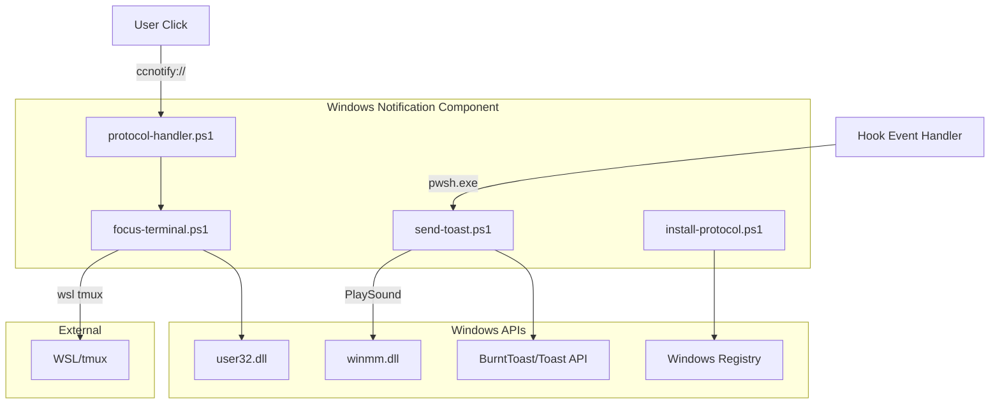

# C4 组件：Windows 通知

## 概览

- **名称**：Windows 通知
- **描述**：发送 Windows Toast 通知并处理点击聚焦动作
- **类型**：应用组件
- **技术**：PowerShell 7、BurntToast 模块、Windows API

## 目的

Windows 通知组件对接 Windows Toast API 来显示通知，并处理用户交互（点击），以聚焦终端窗口并切换到正确的 tmux 窗格。

**关键职责**：

- 创建并显示 Windows Toast 通知
- 播放通知声音
- 通过 URI 协议处理通知点击动作
- 聚焦 Windows Terminal 并切换 tmux 窗格

## 软件特性

| 功能 | 描述 |
|---------|-------------|
| Toast 通知 | 显示包含标题、正文、图片的富通知 |
| 声音播放 | 播放自定义声音，并可配置重复次数 |
| 点击聚焦 | 点击通知后切换到对应任务窗格 |
| 通知分组 | 按会话更新/替换通知 |
| URI 协议处理器 | 处理用于点击动作的 `ccnotify://` 协议 |

## 代码要素

本组件包含以下代码级文档：

- [c4-code-ps.md](c4-code-ps.md) - PowerShell 脚本实现

## 接口

### 输入接口：通知请求

| 参数 | 类型 | 描述 |
|-----------|------|-------------|
| `Type` | string | "running", "need_input", "done", "remove" |
| `SessionId` | string | 用于分组的会话标识符 |
| `TitleB64` | string | Base64 编码的标题 |
| `BodyB64` | string | Base64 编码的正文 |
| `AppLogo` | string | Logo 图片路径 |
| `HeroImage` | string | Hero 图片路径 |
| `SoundPath` | string | 声音文件路径 |
| `SoundRepeat` | int | 声音重复次数 |
| `TmuxInfoB64` | string | Base64 编码的 tmux 信息 |

### 输出接口：用户动作

| 动作 | 触发 | 效果 |
|--------|---------|--------|
| 点击通知 | 用户点击 toast | 调用 `ccnotify://` URI |
| 聚焦终端 | URI 处理器 | SetForegroundWindow + tmux select-pane |

### 协议接口：ccnotify://

| URI 格式 | 描述 |
|------------|-------------|
| `ccnotify://{pane}:{hwnd}` | 聚焦窗口并切换窗格 |

## 依赖

### 使用的组件

- 无（叶子组件）

### 外部系统

- **BurntToast** - 用于 Toast API 的 PowerShell 模块
- **Windows API** - user32.dll、winmm.dll，用于窗口/声音控制
- **Windows Registry** - URI 协议注册
- **WSL** - 用于 tmux 窗格切换

## 组件图

## 通知类型

### 运行中通知

- 更新同一条 toast（按 session tag）
- 显示已用时长与提示词
- 可选应用 logo
- 可配置声音

### 需要输入通知

- 每次都创建新的 toast
- 更高紧急度的声音（默认：重复 2 次）
- 立即送达

### 完成通知

- 先清除运行中通知
- 显示 hero 图片
- 庆祝音效（tada.wav）

## 安全性考虑

- **SEC-2026-0112-0409 H1**：使用 Base64 解码以安全地处理参数
- **SEC-2026-0112-0409 H3**：幂等的 Add-Type 调用，防止重定义攻击
- **SEC-2026-0112-0409 H4**：在协议处理器中校验 TmuxPane 格式
- **SEC-2026-0112-0409 M4**：对注册表修改进行用户确认
