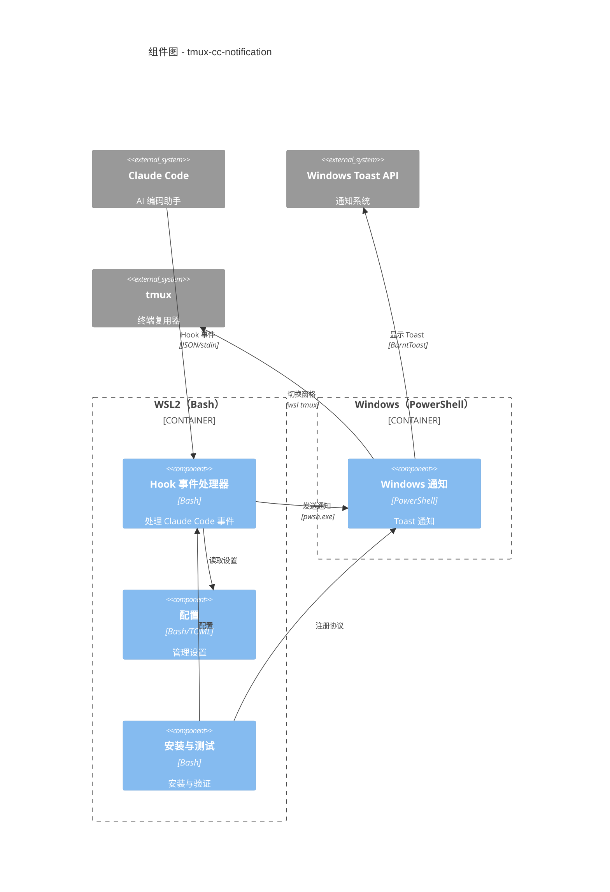
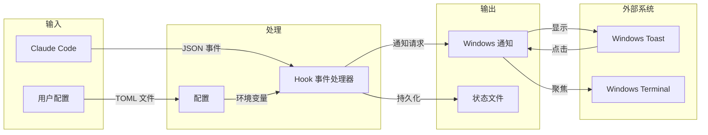

# C4 组件索引

## 系统组件

| 组件 | 描述 | 文档 |
|-----------|-------------|---------------|
| Hook 事件处理器 | 处理 Claude Code 生命周期事件 | [c4-component-hook-handler.md](c4-component-hook-handler.md) |
| Windows 通知 | 发送 Windows Toast 通知 | [c4-component-windows-notification.md](c4-component-windows-notification.md) |
| 配置 | 管理应用设置 | [c4-component-configuration.md](c4-component-configuration.md) |
| 安装与测试 | 安装与验证脚本 | [c4-component-installation.md](c4-component-installation.md) |

## 组件关系图

## 数据流

## 组件依赖矩阵

| 组件 | Hook 事件处理器 | Windows 通知 | 配置 | 安装与测试 |
|-----------|:------------:|:----------------:|:-------------:|:------------:|
| Hook 事件处理器 | - | 使用 | 使用 | - |
| Windows 通知 | - | - | - | - |
| 配置 | - | - | - | - |
| 安装与测试 | 配置 | 注册 | 使用 | - |

## 代码级文档索引

| 目录 | 文档 | 描述 |
|-----------|---------------|-------------|
| lib/ | [c4-code-lib.md](c4-code-lib.md) | 核心库模块 |
| hooks/ | [c4-code-hooks.md](c4-code-hooks.md) | Claude Code hook 脚本 |
| ps/ | [c4-code-ps.md](c4-code-ps.md) | PowerShell 脚本 |
| scripts/ | [c4-code-scripts.md](c4-code-scripts.md) | 安装脚本 |
| (root) | [c4-code-root.md](c4-code-root.md) | 配置加载器 |
