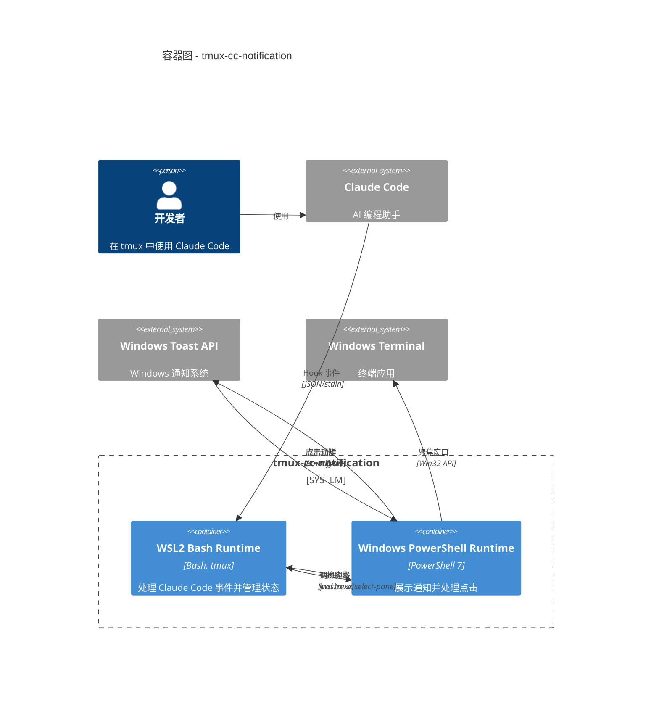
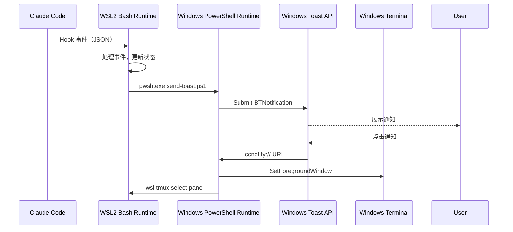

# C4 容器级文档

## 容器概览

tmux-cc-notification 系统由两个主要容器组成，它们跨越 WSL2/Windows 边界进行通信：

| 容器 | 类型 | 技术 | 描述 |
|-----------|------|------------|-------------|
| WSL2 Bash Runtime | 应用 | Bash、tmux | 处理 Claude Code 事件并管理状态 |
| Windows PowerShell Runtime | 应用 | PowerShell 7、BurntToast | 展示通知并处理用户交互 |

## 容器：WSL2 Bash Runtime

### 概览

- **名称**：WSL2 Bash Runtime
- **类型**：应用
- **技术**：Bash Shell、tmux
- **部署**：WSL2 Linux 环境

### 目的

在 WSL2 环境中与 Claude Code 同时运行。接收 Hook 事件、管理任务状态，并协调通知投递。

### 组件

| 组件 | 描述 |
|-----------|-------------|
| [Hook 事件处理器](c4-component-hook-handler.md) | 处理 Claude Code 生命周期事件 |
| [配置](c4-component-configuration.md) | 管理应用设置 |
| [安装与测试](c4-component-installation.md) | 安装与验证脚本 |

### 接口

#### 输入：Claude Code Hooks

| 事件 | 协议 | 描述 |
|-------|----------|-------------|
| `UserPromptSubmit` | stdin JSON | 任务开始 |
| `PreToolUse` | stdin JSON | 工具被使用 |
| `Notification` | stdin JSON | 需要输入 |
| `Stop` | stdin JSON | 任务完成 |

#### 输出：PowerShell 调用

| 操作 | 协议 | 描述 |
|-----------|----------|-------------|
| `send-toast.ps1` | 进程启动 | 发送通知 |
| `install-protocol.ps1` | 进程启动 | 注册 URI 协议 |

### 基础设施

- **状态存储**：`$XDG_CACHE_HOME/cc-notify/{session_id}/`
- **日志存储**：`$XDG_STATE_HOME/cc-notify/`
- **配置文件**：`.tmux_cc_notify_conf.toml`

---

## 容器：Windows PowerShell Runtime

### 概览

- **名称**：Windows PowerShell Runtime
- **类型**：应用
- **技术**：PowerShell 7、BurntToast 模块
- **部署**：Windows 主机（通过 `pwsh.exe`）

### 目的

运行在 Windows 主机上，对接 Windows Toast API。展示通知并处理点击聚焦等交互动作。

### 组件

| 组件 | 描述 |
|-----------|-------------|
| [Windows 通知](c4-component-windows-notification.md) | Toast 通知与点击处理 |

### 接口

#### 输入：脚本调用

| 脚本 | 参数 | 描述 |
|--------|------------|-------------|
| `send-toast.ps1` | Type, SessionId, TitleB64, BodyB64, ... | 发送通知 |
| `focus-terminal.ps1` | TmuxPane, WindowHandle | 聚焦窗口 |
| `protocol-handler.ps1` | Uri | 处理 `ccnotify://` 点击 |

#### 输出：Windows APIs

| API | 协议 | 描述 |
|-----|----------|-------------|
| BurntToast | PowerShell 模块 | Toast 通知 |
| user32.dll | P/Invoke | 窗口管理 |
| winmm.dll | P/Invoke | 声音播放 |
| Registry | PowerShell | URI 协议注册 |

### 基础设施

- **URI 协议**：`ccnotify://` 注册于 `HKCU:\Software\Classes\ccnotify`
- **依赖**：BurntToast PowerShell 模块

---

## 容器图



## 通信流程



## API 规范

### WSL → PowerShell 接口

参见 [apis/wsl-powershell-api.yaml](../apis/wsl-powershell-api.yaml)

### URI 协议接口

| URI | 格式 | 描述 |
|-----|--------|-------------|
| ccnotify:// | `ccnotify://{pane_id}:{hwnd}` | 聚焦终端并切换窗格 |

## 部署

### 前置条件

| 要求 | 容器 | 描述 |
|-------------|-----------|-------------|
| WSL2 | WSL2 Bash | Windows Subsystem for Linux 2 |
| tmux | WSL2 Bash | 终端复用器 |
| jq | WSL2 Bash | JSON 处理器（可选） |
| PowerShell 7 | Windows PS | PowerShell Core |
| BurntToast | Windows PS | Toast 通知模块 |

### 安装

```bash
# 在 WSL2 中
cd tmux-cc-notification
./scripts/install.sh
```

这将会：

1. 检查两个容器中的依赖
2. 在 Windows 中注册 URI 协议
3. 配置 Claude Code hooks
4. 测试通知投递

## 相关文档

- [组件索引](c4-component.md)
- [系统上下文](c4-context.md)
