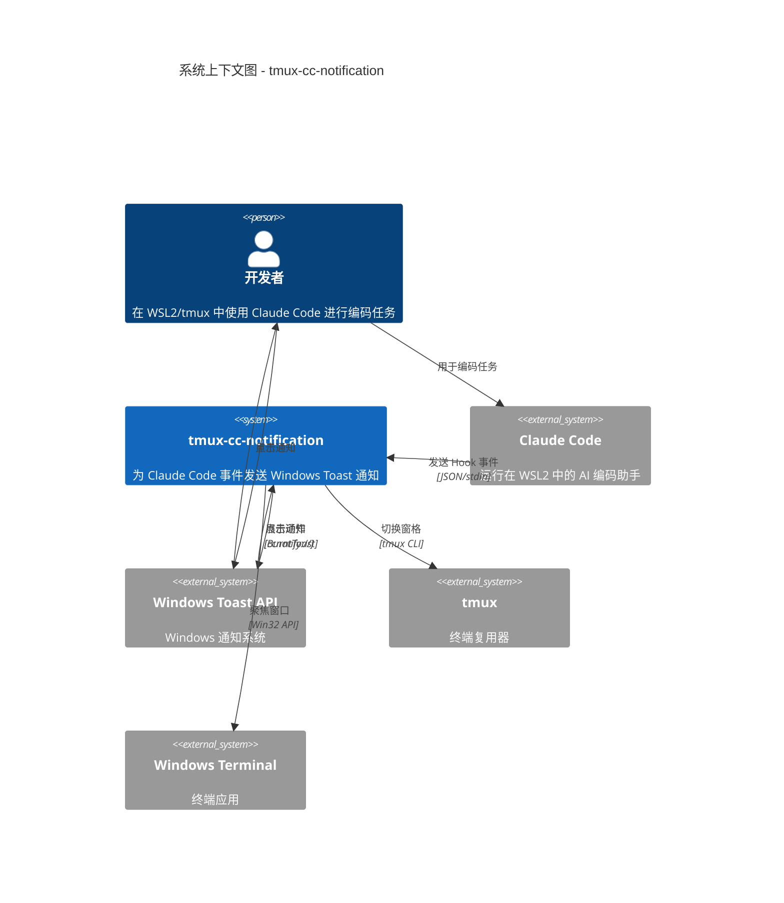

# C4 系统上下文级文档

## 系统概览

### 简短描述

为运行在 WSL2/tmux 中的 Claude Code 提供 Windows Toast 通知。

### 详细描述

**tmux-cc-notification** 是一个通知系统，用于连接 Claude Code（在 WSL2 的 tmux 中运行）与 Windows Toast 通知。它解决了这样一个问题：当 Claude Code 在后台 tmux 窗格中执行长任务时，开发者可能会错过关键事件。

系统通过 Claude Code 的 hook 系统监控其生命周期，并在以下场景发送 Windows Toast 通知：

- **周期性进度更新**：确认任务仍在运行
- **需要输入提醒**：当 Claude 需要权限或用户输入时立即提醒
- **任务完成**：任务结束时通知你

其中的关键能力是 **点击聚焦（click-to-focus）**：点击通知即可切换到正确的 tmux 窗格，即使 Windows Terminal 最小化或处于后台也能生效。

**智能抑制（smart suppression）** 可在你正在查看任务窗格时避免通知刷屏。

## 角色画像（Personas）

### 人类用户

| 画像 | 类型 | 描述 | 目标 | 主要使用特性 |
|---------|------|-------------|-------|-------------------|
| 开发者 | 人类用户 | 使用 Claude Code 进行编码任务的软件开发者 | 不必持续盯着终端也能掌握任务进度 | 周期性通知、完成提醒、点击聚焦 |
| 高级用户 | 人类用户 | 同时运行多个 Claude Code 会话的开发者 | 跟踪多个任务，并在会话间快速切换 | 按会话分组的通知、点击聚焦 |

### 程序化用户

| 画像 | 类型 | 描述 | 目标 | 主要使用特性 |
|---------|------|-------------|-------|-------------------|
| Claude Code | 外部系统 | 执行任务的 AI 编码助手 | 在关键事件发生时通知用户（需要输入、任务完成） | Hook 事件接口 |

## 系统特性

| 特性 | 描述 | 用户 | 旅程 |
|---------|-------------|-------|---------|
| 周期性通知 | 对长时间运行的任务，每 N 分钟发送一次进度更新 | 开发者、高级用户 | [运行中任务旅程](#running-task-journey) |
| 需要输入提醒 | 当 Claude 需要权限/输入时立即通知 | 开发者、高级用户 | [需要输入旅程](#input-required-journey) |
| 任务完成 | 任务完成时发送带 hero 图片的通知 | 开发者、高级用户 | [任务完成旅程](#task-completion-journey) |
| 点击聚焦 | 点击通知以切换到任务窗格 | 开发者、高级用户 | [点击聚焦旅程](#click-to-focus-journey) |
| 智能抑制 | 当用户正在查看任务窗格时跳过通知 | 开发者、高级用户 | [抑制旅程](#suppression-journey) |

## 用户旅程

### 运行中任务旅程

**特性**：周期性通知  
**角色**：开发者

1. 开发者在 tmux 中向 Claude Code 提交提示词
2. 系统记录任务开始并启动后台监控
3. 开发者切换到其他窗口/任务
4. 每 5 分钟（可配置），系统检查任务是否仍在运行
5. 若任务仍在运行且开发者未在查看该窗格，则弹出通知
6. 通知显示已用时长与原始提示词
7. 开发者点击通知以查看进度
8. 系统聚焦 Windows Terminal 并切换到任务窗格

### 需要输入旅程

**特性**：需要输入提醒  
**角色**：开发者

1. Claude Code 遇到权限提示或需要用户输入
2. 系统立即发送“需要输入”的通知
3. 通知播放注意力提示音（可配置重复次数）
4. 即使开发者正在使用其他应用也能看到通知
5. 开发者点击通知
6. 系统聚焦终端并切换到正确的窗格
7. 开发者向 Claude Code 提供输入
8. 系统清除等待状态并恢复正常监控

### 任务完成旅程

**特性**：任务完成  
**角色**：开发者

1. Claude Code 完成任务
2. 系统发送带 hero 图片的完成通知
3. 通知显示总耗时
4. 系统清除任何已有的“运行中”通知
5. 系统清理状态文件并停止后台监控
6. 开发者点击通知以查看结果

### 点击聚焦旅程

**特性**：点击聚焦  
**角色**：高级用户

1. 用户收到任意事件类型的通知
2. 用户点击通知上的 “Switch to Task” 按钮
3. Windows 触发 `ccnotify://` URI 协议
4. 协议处理器解析窗格 ID 与窗口句柄
5. 若 Windows Terminal 已最小化则恢复窗口
6. 系统将 Windows Terminal 置于前台
7. 系统执行 `tmux select-pane` 切换到正确窗格
8. 用户现在正在查看对应的 Claude Code 会话

### 抑制旅程

**特性**：智能抑制  
**角色**：开发者

1. 开发者正在查看 Claude Code 窗格
2. 触发通知条件（周期性/需要输入/完成）
3. 系统检查 Windows Terminal 是否为前台窗口
4. 系统检查当前 tmux 窗格是否匹配任务窗格
5. 系统考虑缩放状态（zoom 时仅显示活动窗格）
6. 若用户正在查看任务窗格，则抑制通知
7. 开发者可不被打扰地继续工作

## 外部系统与依赖

| 系统 | 类型 | 描述 | 集成方式 | 用途 |
|--------|------|-------------|-------------|---------|
| Claude Code | 外部应用 | AI 编码助手 | 通过 stdin JSON 的 Hook 事件 | 生命周期事件来源 |
| Windows Toast API | 系统服务 | Windows 通知系统 | BurntToast PowerShell 模块 | 展示通知 |
| tmux | 外部应用 | 终端复用器 | CLI 命令 | 会话/窗格管理 |
| Windows Terminal | 外部应用 | 终端模拟器 | Win32 API（user32.dll） | 窗口聚焦管理 |
| Windows Registry | 系统服务 | 配置存储 | PowerShell 注册表命令 | URI 协议注册 |
| 文件系统 | 系统服务 | 持久化存储 | Bash 文件操作 | 状态与配置存储 |

## 系统上下文图

## 相关文档

- [容器级文档](c4-container.md) - 部署架构
- [组件索引](c4-component.md) - 内部组件
- [README](../../../README.md) - 用户文档
