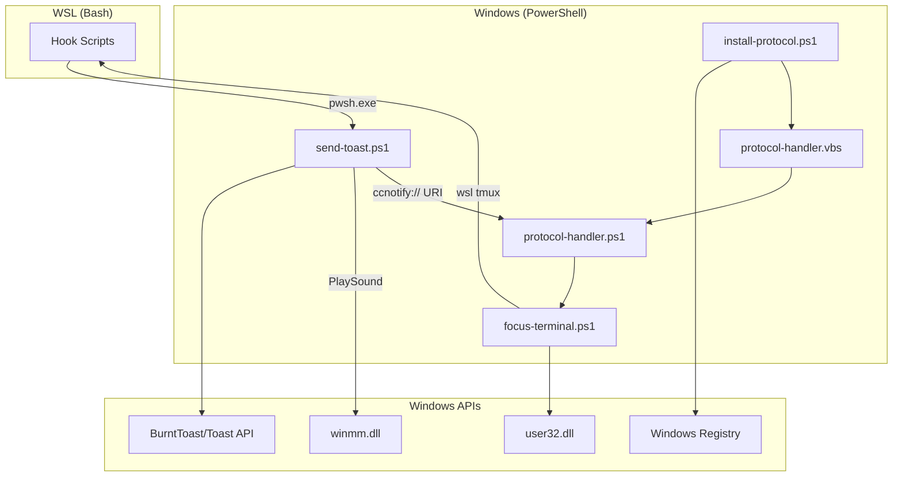
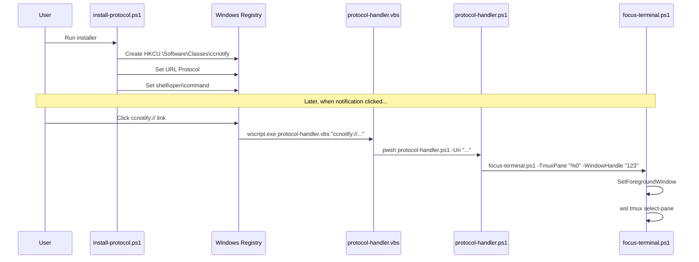

# C4 Code-Level Documentation: ps/

## Overview

- **Name**: PowerShell Scripts
- **Description**: Windows-side scripts for toast notifications and window management
- **Location**: [ps/](../../../ps/)
- **Language**: PowerShell 7
- **Purpose**: Interface with Windows Toast API (BurntToast), handle URI protocol, and manage window focus

## Code Elements

### send-toast.ps1

**Location**: [ps/send-toast.ps1](../../../ps/send-toast.ps1)

**Purpose**: Main notification sender - creates and displays Windows Toast notifications.

| Parameter | Type | Description |
|-----------|------|-------------|
| `Type` | string | Notification type: "running", "need_input", "done", "remove" |
| `SessionId` | string | Session identifier for notification grouping |
| `Title` | string | Notification title (plain text) |
| `Body` | string | Notification body (plain text) |
| `TitleB64` | string | Base64-encoded title (preferred, SEC-2026-0112-0409 H1) |
| `BodyB64` | string | Base64-encoded body (preferred) |
| `TmuxInfoB64` | string | Base64-encoded tmux info for click action |
| `AppLogo` | string | Path to app logo image |
| `HeroImage` | string | Path to hero image (for "done" type) |
| `SoundPath` | string | Path to sound file |
| `SoundRepeat` | int | Number of times to play sound |
| `UpdateSame` | string | "1" to update existing notification |
| `TmuxInfo` | string | Plain tmux info (fallback) |

| Function | Signature | Description |
|----------|-----------|-------------|
| `Decode-Base64` | `Decode-Base64($Encoded) -> string` | Decode Base64 UTF-8 string |
| `Get-NotificationTag` | `Get-NotificationTag($Type, $SessionId) -> string` | Generate unique notification tag |
| `Remove-Notification` | `Remove-Notification($Tag)` | Remove notification by tag |
| `Send-Notification` | `Send-Notification(...)` | Build and submit toast notification |

**Notification Types**:

- `running` - Progress notification, updates same toast
- `need_input` - Input required, creates new toast each time
- `done` - Completion notification with hero image, clears running toast
- `remove` - Remove all notifications for session

**Security Features**:

- SEC-2026-0112-0409 H1: Base64 parameter decoding
- SEC-2026-0112-0409 H3: Idempotent Add-Type for WinSound

### focus-terminal.ps1

**Location**: [ps/focus-terminal.ps1](../../../ps/focus-terminal.ps1)

**Purpose**: Focus Windows Terminal window and switch to target tmux pane.

| Parameter | Type | Description |
|-----------|------|-------------|
| `TmuxPane` | string | Target tmux pane ID (e.g., "%0") |
| `WindowHandle` | string | Windows Terminal HWND |

| Win32 API | Description |
|-----------|-------------|
| `SetForegroundWindow` | Bring window to foreground |
| `ShowWindow` | Restore minimized window |
| `IsIconic` | Check if window is minimized |
| `IsWindow` | Validate window handle |
| `GetForegroundWindow` | Get current foreground window |
| `GetWindowThreadProcessId` | Get window's thread/process ID |
| `GetCurrentThreadId` | Get current thread ID |
| `AttachThreadInput` | Attach thread input for focus bypass |
| `BringWindowToTop` | Bring window to top of Z-order |

**Flow**:

1. Validate/find window handle
2. Restore if minimized
3. Use AttachThreadInput to bypass foreground restriction
4. Set foreground window
5. Switch tmux pane via WSL

### protocol-handler.ps1

**Location**: [ps/protocol-handler.ps1](../../../ps/protocol-handler.ps1)

**Purpose**: Handle `ccnotify://` URI protocol - parse URI and invoke focus-terminal.ps1.

| Parameter | Type | Description |
|-----------|------|-------------|
| `Uri` | string | Full URI (e.g., "ccnotify://%0:12345") |

| Function | Signature | Description |
|----------|-----------|-------------|
| `Validate-TmuxPane` | `Validate-TmuxPane($Pane) -> string|null` | Validate tmux pane format |

**URI Format**: `ccnotify://{pane_id}:{hwnd}`

**Security Features**:

- SEC-2026-0112-0409 H4: TmuxPane format validation (prevents injection)

### install-protocol.ps1

**Location**: [ps/install-protocol.ps1](../../../ps/install-protocol.ps1)

**Purpose**: Register `ccnotify://` URI protocol in Windows Registry.

| Parameter | Type | Description |
|-----------|------|-------------|
| `-Force` | switch | Skip confirmation prompt |
| `-Uninstall` | switch | Remove protocol registration |
| `-Lang` | string | UI language ("zh" or "en") |

| Function | Signature | Description |
|----------|-----------|-------------|
| `Get-UILang` | `Get-UILang() -> string` | Detect UI language from system locale |
| `Find-PowerShell` | `Find-PowerShell() -> path` | Find PowerShell 7 executable |

**Registry Path**: `HKCU:\Software\Classes\ccnotify`

**Security Features**:

- SEC-2026-0112-0409 M4: Path validation, user confirmation, uninstall support

### install-protocol-local.ps1

**Location**: [ps/install-protocol-local.ps1](../../../ps/install-protocol-local.ps1)

**Purpose**: Non-interactive version of install-protocol.ps1 for automated installation.

Similar to `install-protocol.ps1` but with `-Force` behavior by default.

## Dependencies

### Internal Dependencies

- `send-toast.ps1` → `focus-terminal.ps1` (via URI protocol)
- `protocol-handler.ps1` → `focus-terminal.ps1`
- `install-protocol.ps1` → `protocol-handler.vbs`

### External Dependencies

- **BurntToast** - PowerShell module for Windows Toast notifications
- **Windows API** (user32.dll, winmm.dll, kernel32.dll)
- **WSL** - For tmux pane switching

## Relationships

## Protocol Registration Flow

