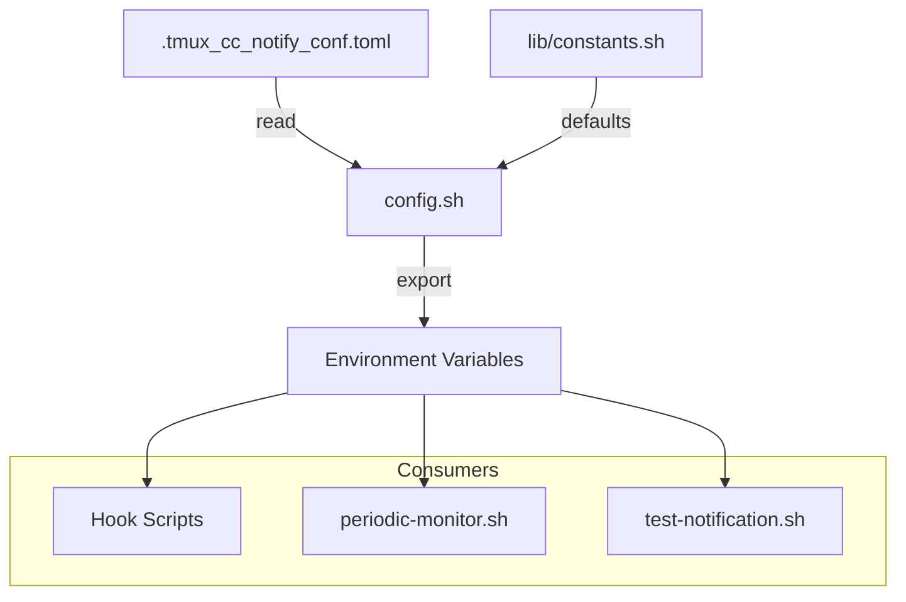

# C4 Code-Level Documentation: Root Configuration

## Overview

- **Name**: Root Configuration Module
- **Description**: Main configuration loader and TOML parser
- **Location**: [config.sh](../../../config.sh)
- **Language**: Bash (Shell Script)
- **Purpose**: Load and parse TOML configuration file, provide configuration values with defaults

## Code Elements

### config.sh

**Location**: [config.sh](../../../config.sh)

| Function | Signature | Description |
|----------|-----------|-------------|
| `get_config` | `get_config(section, key, default) -> value` | Get string config value from TOML |
| `get_config_bool` | `get_config_bool(section, key, default) -> "0"|"1"` | Get boolean config value |
| `get_config_int` | `get_config_int(section, key, default) -> int` | Get integer config value |
| `load_all_config` | `load_all_config()` | Load all config into environment variables |
| `validate_config_bounds` | `validate_config_bounds()` | Validate config values are within bounds |

**Configuration File**: `.tmux_cc_notify_conf.toml`

**Environment Variables Set by `load_all_config()`**:

| Variable | Section.Key | Default | Description |
|----------|-------------|---------|-------------|
| `CC_NOTIFY_APP_LOGO` | assets.app_logo | "" | Path to app logo image |
| `CC_NOTIFY_HERO_IMAGE` | assets.hero_image_task_end | "" | Path to hero image |
| `CC_NOTIFY_TITLE_TPL` | text.title | "{session} Claude Code" | Title template |
| `CC_NOTIFY_RUNNING_BODY_TPL` | text.running_body | "[Running: {mm} min] {prompt}" | Running body template |
| `CC_NOTIFY_DONE_BODY_TPL` | text.done_body | "[Total: {mm} min] {prompt}" | Done body template |
| `CC_NOTIFY_NEED_INPUT_BODY` | text.need_input_body | "Permission/input required" | Input body text |
| `CC_NOTIFY_PROMPT_MAX_CHARS` | text.prompt_max_chars | 60 | Max prompt display chars |
| `CC_NOTIFY_RUNNING_ENABLED` | running.enabled | 1 | Enable periodic notifications |
| `CC_NOTIFY_RUNNING_INTERVAL` | running.interval_minutes | 5 | Notification interval (minutes) |
| `CC_NOTIFY_RUNNING_SOUND` | running.sound_path | "C:\Windows\Media\chimes.wav" | Running sound file |
| `CC_NOTIFY_RUNNING_SOUND_REPEAT` | running.sound_repeat | 1 | Sound repeat count |
| `CC_NOTIFY_RUNNING_UPDATE_SAME` | running.update_same_toast | 1 | Update same toast |
| `CC_NOTIFY_NEED_INPUT_ENABLED` | need_input.enabled | 1 | Enable input notifications |
| `CC_NOTIFY_NEED_INPUT_SOUND` | need_input.sound_path | "C:\Windows\Media\notify.wav" | Input sound file |
| `CC_NOTIFY_NEED_INPUT_SOUND_REPEAT` | need_input.sound_repeat | 2 | Sound repeat count |
| `CC_NOTIFY_DONE_ENABLED` | done.enabled | 1 | Enable done notifications |
| `CC_NOTIFY_DONE_SOUND` | done.sound_path | "C:\Windows\Media\tada.wav" | Done sound file |
| `CC_NOTIFY_DONE_SOUND_REPEAT` | done.sound_repeat | 1 | Sound repeat count |
| `CC_NOTIFY_SUPPRESS_ENABLED` | suppress.enabled | 1 | Enable suppression |
| `CC_NOTIFY_SUPPRESS_NEED_INPUT` | suppress.need_input | 1 | Suppress input notifications |
| `CC_NOTIFY_SUPPRESS_RUNNING` | suppress.running | 1 | Suppress running notifications |
| `CC_NOTIFY_SUPPRESS_DONE` | suppress.done | 1 | Suppress done notifications |
| `CC_NOTIFY_PWSH_EXECUTION_POLICY` | security.pwsh_execution_policy | "RemoteSigned" | PowerShell execution policy |
| `CC_NOTIFY_PWSH_PATH` | system.pwsh_path | "" | Custom PowerShell path |

**Bounds Validation** (SEC-2026-0112-0409 L3):

- `prompt_max_chars`: 10-500
- `running_interval`: 1-60 minutes
- `sound_repeat`: 1-10

## TOML Parser

The `get_config` function implements a simple TOML parser:

1. Skip empty lines and comments (`#`)
2. Track current section (`[section]`)
3. Match `key = value` within target section
4. Strip inline comments
5. Remove quotes from values
6. Handle TOML escape sequences (`\\` → `\`)

## Configuration File Format

```toml
[assets]
# Optional: Custom app logo and hero image
# app_logo = "C:\\path\\to\\logo.png"
# hero_image_task_end = "C:\\path\\to\\hero.png"

[text]
title = "{session} Claude Code"
running_body = "[Running: {mm} min] {prompt}"
done_body = "[Total: {mm} min] {prompt}"
need_input_body = "Permission/input required"
prompt_max_chars = 60

[running]
enabled = true
interval_minutes = 5
sound_path = "C:\\Windows\\Media\\chimes.wav"
sound_repeat = 1

[need_input]
enabled = true
sound_path = "C:\\Windows\\Media\\notify.wav"
sound_repeat = 2

[done]
enabled = true
sound_path = "C:\\Windows\\Media\\tada.wav"
sound_repeat = 1

[suppress]
enabled = true
need_input = true
running = true
done = true

[security]
pwsh_execution_policy = "RemoteSigned"

[system]
# pwsh_path = "/custom/path/to/pwsh.exe"
```

## Template Variables

| Variable | Description |
|----------|-------------|
| `{session}` | tmux session name |
| `{mm}` | Elapsed minutes |
| `{prompt}` | User's input (truncated) |

## Dependencies

### Internal Dependencies

- `lib/constants.sh` - Default values

### External Dependencies

- None (pure Bash)

## Relationships


