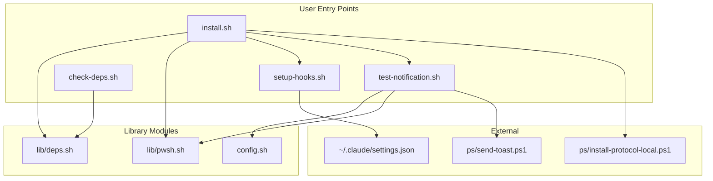

# C4 Code-Level Documentation: scripts/

## Overview

- **Name**: Installation and Testing Scripts
- **Description**: User-facing scripts for installation, configuration, and testing
- **Location**: [scripts/](../../../scripts/)
- **Language**: Bash (Shell Script)
- **Purpose**: Provide easy installation, hook configuration, dependency checking, and notification testing

## Code Elements

### install.sh

**Location**: [scripts/install.sh](../../../scripts/install.sh)

**Purpose**: One-click installer that sets up the entire notification system.

| Function | Signature | Description |
|----------|-----------|-------------|
| `detect_lang` | `detect_lang() -> "zh"|"en"` | Detect UI language from locale/Windows |
| `print_step` | `print_step(message)` | Print green step indicator |
| `print_warn` | `print_warn(message)` | Print yellow warning |
| `print_error` | `print_error(message)` | Print red error |

**Installation Steps**:

1. Check dependencies (jq, tmux, PowerShell, BurntToast, wslpath)
2. Copy config template if not exists
3. Register `ccnotify://` URI protocol
4. Configure Claude Code hooks
5. Send test notification

**Arguments**:

- `--lang zh|en` - Force UI language

### setup-hooks.sh

**Location**: [scripts/setup-hooks.sh](../../../scripts/setup-hooks.sh)

**Purpose**: Configure Claude Code hooks in `~/.claude/settings.json`.

| Function | Signature | Description |
|----------|-----------|-------------|
| `detect_lang` | `detect_lang() -> "zh"|"en"` | Detect UI language |
| `generate_hooks_json` | `generate_hooks_json() -> json` | Generate hooks configuration JSON |
| `print_hooks_config` | `print_hooks_config()` | Print hooks config for manual copy |
| `print_info` | `print_info(message)` | Print info message |
| `print_warn` | `print_warn(message)` | Print warning message |

**Configuration Methods**:

1. **With jq**: Deep merge hooks into existing settings
2. **Without jq (fallback)**:
   - Create new file if none exists
   - Insert hooks if no existing hooks config
   - Print manual instructions if hooks already exist

**Generated Hook Events**:

- `UserPromptSubmit` → `on-task-start.sh`
- `Notification` (matcher: `permission_prompt|elicitation_dialog`) → `on-need-input.sh`
- `PreToolUse` → `on-tool-use.sh`
- `Stop` → `on-task-end.sh`

### check-deps.sh

**Location**: [scripts/check-deps.sh](../../../scripts/check-deps.sh)

**Purpose**: Check and display dependency status.

Simply sources `lib/deps.sh` and calls `print_dependency_status()`.

**Checked Dependencies**:

- jq (JSON processor)
- tmux (terminal multiplexer)
- PowerShell 7 (pwsh.exe)
- BurntToast (PowerShell module)
- wslpath (WSL utility)

### test-notification.sh

**Location**: [scripts/test-notification.sh](../../../scripts/test-notification.sh)

**Purpose**: Test notification functionality.

| Argument | Description |
|----------|-------------|
| `all` | Test all notification types |
| `running` | Test periodic/running notification |
| `input` | Test input-required notification |
| `done` | Test completion notification |
| `click` | Test click-to-focus functionality |
| `cleanup` | Remove all test notifications |

**Test Flow**:

1. Generate test session ID
2. Load configuration
3. Send notification via PowerShell
4. Display result

## Dependencies

### Internal Dependencies

- `install.sh` → `lib/deps.sh`, `lib/pwsh.sh`, `setup-hooks.sh`, `test-notification.sh`
- `setup-hooks.sh` → (none, self-contained)
- `check-deps.sh` → `lib/deps.sh`
- `test-notification.sh` → `config.sh`, `lib/pwsh.sh`

### External Dependencies

- jq (optional for setup-hooks.sh)
- PowerShell 7
- BurntToast module
- wslpath

## Relationships



## Usage Examples

```bash
# Full installation
./scripts/install.sh

# Check dependencies only
./scripts/check-deps.sh

# Configure hooks only
./scripts/setup-hooks.sh

# Test all notifications
./scripts/test-notification.sh all

# Test specific notification type
./scripts/test-notification.sh done

# Clean up test notifications
./scripts/test-notification.sh cleanup
```
