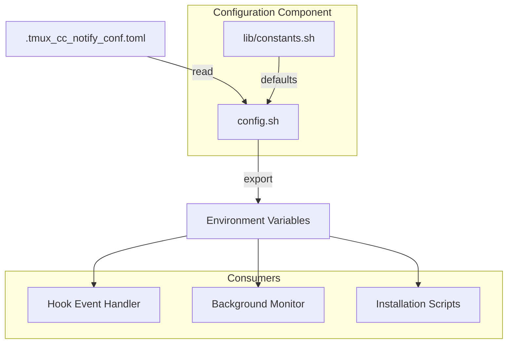

# C4 Component: Configuration

## Overview

- **Name**: Configuration
- **Description**: Manages application configuration and user preferences
- **Type**: Library Component
- **Technology**: Bash Shell Script, TOML

## Purpose

The Configuration component provides a centralized way to manage all notification settings. It parses TOML configuration files and exposes settings as environment variables for other components.

**Key Responsibilities**:

- Parse TOML configuration files
- Provide default values for all settings
- Validate configuration bounds
- Export settings as environment variables

## Software Features

| Feature | Description |
|---------|-------------|
| TOML Parsing | Parse configuration from `.tmux_cc_notify_conf.toml` |
| Default Values | Sensible defaults for all settings |
| Type Conversion | Boolean, integer, and string config types |
| Bounds Validation | Ensure values are within acceptable ranges |
| Environment Export | Export all settings as `CC_NOTIFY_*` variables |

## Code Elements

This component contains the following code-level documentation:

- [c4-code-root.md](c4-code-root.md) - Configuration loader (config.sh)
- [c4-code-lib.md](c4-code-lib.md) - Constants (lib/constants.sh)

## Interfaces

### Input Interface: Configuration File

**File**: `.tmux_cc_notify_conf.toml`

| Section | Keys | Description |
|---------|------|-------------|
| `[assets]` | app_logo, hero_image_task_end | Image paths |
| `[text]` | title, running_body, done_body, need_input_body, prompt_max_chars | Text templates |
| `[running]` | enabled, interval_minutes, sound_path, sound_repeat, update_same_toast | Running notification settings |
| `[need_input]` | enabled, sound_path, sound_repeat | Input notification settings |
| `[done]` | enabled, sound_path, sound_repeat | Done notification settings |
| `[suppress]` | enabled, need_input, running, done | Suppression settings |
| `[security]` | pwsh_execution_policy | Security settings |
| `[system]` | pwsh_path | System paths |

### Output Interface: Environment Variables

| Variable | Type | Description |
|----------|------|-------------|
| `CC_NOTIFY_APP_LOGO` | string | App logo path |
| `CC_NOTIFY_HERO_IMAGE` | string | Hero image path |
| `CC_NOTIFY_TITLE_TPL` | string | Title template |
| `CC_NOTIFY_RUNNING_*` | various | Running notification settings |
| `CC_NOTIFY_NEED_INPUT_*` | various | Input notification settings |
| `CC_NOTIFY_DONE_*` | various | Done notification settings |
| `CC_NOTIFY_SUPPRESS_*` | bool | Suppression flags |
| `CC_NOTIFY_PWSH_*` | string | PowerShell settings |

### API Functions

| Function | Signature | Description |
|----------|-----------|-------------|
| `get_config` | `(section, key, default) -> string` | Get config value |
| `get_config_bool` | `(section, key, default) -> "0"|"1"` | Get boolean config |
| `get_config_int` | `(section, key, default) -> int` | Get integer config |
| `load_all_config` | `()` | Load all config to env vars |

## Dependencies

### Components Used

- None (leaf component)

### External Systems

- File system (config file)

## Component Diagram

## Configuration Sections

### Text Templates

Templates support these variables:

- `{session}` - tmux session name
- `{mm}` - elapsed minutes
- `{prompt}` - user's input (truncated)

### Bounds Validation

| Setting | Min | Max | Default |
|---------|-----|-----|---------|
| prompt_max_chars | 10 | 500 | 60 |
| interval_minutes | 1 | 60 | 5 |
| sound_repeat | 1 | 10 | 1-2 |

## Security Considerations

- **SEC-2026-0112-0409 L3**: Configuration bounds validation
- **SEC-2026-0112-0409 M2**: PowerShell execution policy configuration
- **SEC-2026-0112-0409 L2**: Custom PowerShell path support
