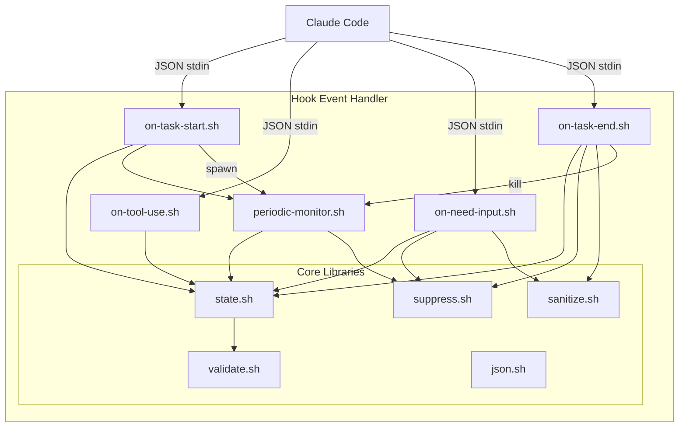

# C4 Component: Hook Event Handler

## Overview

- **Name**: Hook Event Handler
- **Description**: Processes Claude Code lifecycle events and triggers appropriate notifications
- **Type**: Application Component
- **Technology**: Bash Shell Scripts

## Purpose

The Hook Event Handler component receives events from Claude Code's hook system and orchestrates the notification workflow. It acts as the bridge between Claude Code and the Windows notification system.

**Key Responsibilities**:

- Parse and validate JSON input from Claude Code hooks
- Manage task state (start, running, waiting, complete)
- Determine when notifications should be sent or suppressed
- Coordinate with the Windows Notification component

## Software Features

| Feature | Description |
|---------|-------------|
| Task Lifecycle Tracking | Track task start, tool usage, input requests, and completion |
| State Persistence | Maintain task state across hook invocations |
| Input Validation | Validate all inputs to prevent injection attacks |
| Suppression Logic | Skip notifications when user is viewing the task pane |
| Background Monitoring | Periodic check for long-running tasks |

## Code Elements

This component contains the following code-level documentation:

- [c4-code-hooks.md](c4-code-hooks.md) - Hook script implementations
- [c4-code-lib.md](c4-code-lib.md) - Core library modules (state, suppress, validate, json)

## Interfaces

### Input Interface: Claude Code Hooks

| Event | Trigger | JSON Fields |
|-------|---------|-------------|
| `UserPromptSubmit` | User submits prompt | `session_id`, `prompt` |
| `PreToolUse` | Before tool execution | `session_id`, `tool_name` |
| `Notification` | Permission/input needed | `session_id`, `type` |
| `Stop` | Task completes | `session_id` |

### Output Interface: Notification Requests

| Operation | Parameters | Description |
|-----------|------------|-------------|
| `send_notification` | type, session_id, title, body, options | Request toast notification |
| `state_update` | session_id, state_data | Update persistent state |

## Dependencies

### Components Used

- **Windows Notification Component** - For sending toast notifications
- **Configuration Component** - For notification settings

### External Systems

- **Claude Code** - Provides hook events via stdin JSON
- **tmux** - Provides session/pane information
- **File System** - State persistence in `$XDG_CACHE_HOME/cc-notify/`

## Component Diagram

## Security Considerations

- **SEC-2026-0112-0409 H1**: Base64 encoding for PowerShell parameters
- **SEC-2026-0112-0409 H2**: Session ID validation (alphanumeric, no path traversal)
- **SEC-2026-0112-0409 M3**: Fail-fast JSON validation
- **SEC-2026-0112-0409 M5**: PID ownership verification before process termination
