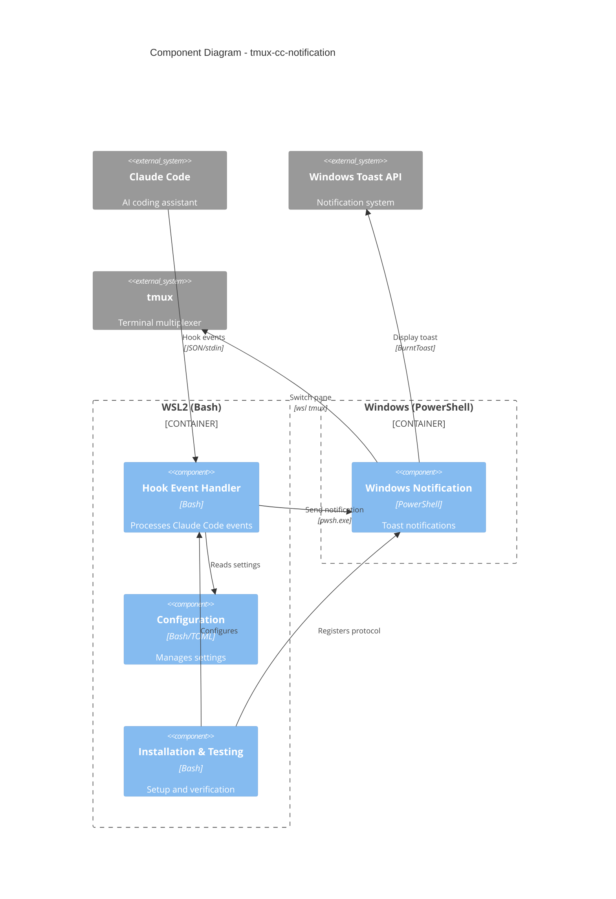
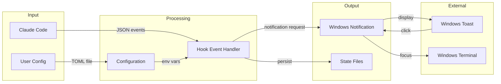

# C4 Component Index

## System Components

| Component | Description | Documentation |
|-----------|-------------|---------------|
| Hook Event Handler | Processes Claude Code lifecycle events | [c4-component-hook-handler.md](c4-component-hook-handler.md) |
| Windows Notification | Sends Windows Toast notifications | [c4-component-windows-notification.md](c4-component-windows-notification.md) |
| Configuration | Manages application settings | [c4-component-configuration.md](c4-component-configuration.md) |
| Installation & Testing | Setup and verification scripts | [c4-component-installation.md](c4-component-installation.md) |

## Component Relationships Diagram

## Data Flow

## Component Dependencies Matrix

| Component | Hook Handler | Win Notification | Configuration | Installation |
|-----------|:------------:|:----------------:|:-------------:|:------------:|
| Hook Event Handler | - | Uses | Uses | - |
| Windows Notification | - | - | - | - |
| Configuration | - | - | - | - |
| Installation & Testing | Configures | Registers | Uses | - |

## Code-Level Documentation Index

| Directory | Documentation | Description |
|-----------|---------------|-------------|
| lib/ | [c4-code-lib.md](c4-code-lib.md) | Core library modules |
| hooks/ | [c4-code-hooks.md](c4-code-hooks.md) | Claude Code hook scripts |
| ps/ | [c4-code-ps.md](c4-code-ps.md) | PowerShell scripts |
| scripts/ | [c4-code-scripts.md](c4-code-scripts.md) | Installation scripts |
| (root) | [c4-code-root.md](c4-code-root.md) | Configuration loader |
