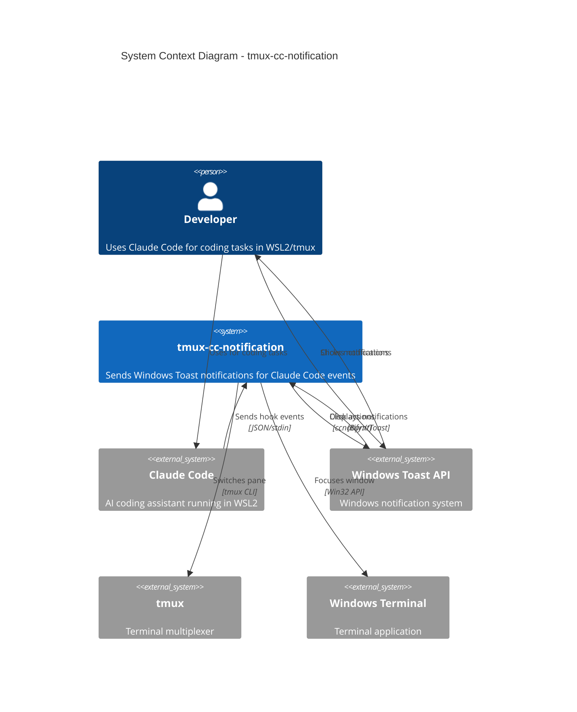

# C4 Context-Level Documentation

## System Overview

### Short Description

Windows Toast notifications for Claude Code running in WSL2/tmux.

### Long Description

**tmux-cc-notification** is a notification system that bridges Claude Code (running in WSL2 with tmux) and Windows Toast notifications. It solves the problem of developers missing important events when Claude Code is running long tasks in a background tmux pane.

The system monitors Claude Code's lifecycle through its hook system and sends Windows Toast notifications for:

- **Periodic progress updates** - Know your task is still running
- **Input required alerts** - Immediate notification when Claude needs permission or input
- **Task completion** - Know when your task is done

A key feature is **click-to-focus**: clicking a notification switches to the correct tmux pane, even if Windows Terminal is minimized or in the background.

**Smart suppression** prevents notification spam when you're already viewing the task pane.

## Personas

### Human Users

| Persona | Type | Description | Goals | Key Features Used |
|---------|------|-------------|-------|-------------------|
| Developer | Human User | Software developer using Claude Code for coding tasks | Stay informed about task progress without constantly watching the terminal | Periodic notifications, completion alerts, click-to-focus |
| Power User | Human User | Developer running multiple Claude Code sessions | Track multiple tasks, quickly switch between sessions | Session-based notification grouping, click-to-focus |

### Programmatic Users

| Persona | Type | Description | Goals | Key Features Used |
|---------|------|-------------|-------|-------------------|
| Claude Code | External System | AI coding assistant that executes tasks | Notify user of important events (input needed, task complete) | Hook event interface |

## System Features

| Feature | Description | Users | Journey |
|---------|-------------|-------|---------|
| Periodic Notifications | Progress updates every N minutes for long-running tasks | Developer, Power User | [Running Task Journey](#running-task-journey) |
| Input Required Alerts | Immediate notification when Claude needs permission | Developer, Power User | [Input Required Journey](#input-required-journey) |
| Task Completion | Notification with hero image when task completes | Developer, Power User | [Task Completion Journey](#task-completion-journey) |
| Click-to-Focus | Click notification to switch to task pane | Developer, Power User | [Click-to-Focus Journey](#click-to-focus-journey) |
| Smart Suppression | Skip notifications when user is viewing pane | Developer, Power User | [Suppression Journey](#suppression-journey) |

## User Journeys

### Running Task Journey

**Feature**: Periodic Notifications
**Persona**: Developer

1. Developer submits a prompt to Claude Code in tmux
2. System records task start and begins background monitoring
3. Developer switches to another window/task
4. Every 5 minutes (configurable), system checks if task is still running
5. If task is running and developer is not viewing the pane, notification appears
6. Notification shows elapsed time and original prompt
7. Developer clicks notification to check progress
8. System focuses Windows Terminal and switches to task pane

### Input Required Journey

**Feature**: Input Required Alerts
**Persona**: Developer

1. Claude Code encounters a permission prompt or needs user input
2. System immediately sends "input required" notification
3. Notification plays attention sound (configurable repeats)
4. Developer sees notification even if in another application
5. Developer clicks notification
6. System focuses terminal and switches to correct pane
7. Developer provides input to Claude Code
8. System clears waiting state and resumes normal monitoring

### Task Completion Journey

**Feature**: Task Completion
**Persona**: Developer

1. Claude Code completes the task
2. System sends completion notification with hero image
3. Notification shows total elapsed time
4. System clears any existing "running" notifications
5. System cleans up state files and stops background monitor
6. Developer clicks notification to review results

### Click-to-Focus Journey

**Feature**: Click-to-Focus
**Persona**: Power User

1. User receives notification for any event type
2. User clicks the "Switch to Task" button on notification
3. Windows activates `ccnotify://` URI protocol
4. Protocol handler parses pane ID and window handle
5. System restores Windows Terminal if minimized
6. System brings Windows Terminal to foreground
7. System executes `tmux select-pane` to switch to correct pane
8. User is now viewing the Claude Code session

### Suppression Journey

**Feature**: Smart Suppression
**Persona**: Developer

1. Developer is actively viewing the Claude Code pane
2. Notification trigger occurs (periodic, input, or done)
3. System checks if Windows Terminal is foreground window
4. System checks if current tmux pane matches task pane
5. System considers zoom state (only active pane visible when zoomed)
6. If user is viewing the task pane, notification is suppressed
7. Developer continues working without interruption

## External Systems and Dependencies

| System | Type | Description | Integration | Purpose |
|--------|------|-------------|-------------|---------|
| Claude Code | External Application | AI coding assistant | Hook events via stdin JSON | Source of lifecycle events |
| Windows Toast API | System Service | Windows notification system | BurntToast PowerShell module | Display notifications |
| tmux | External Application | Terminal multiplexer | CLI commands | Session/pane management |
| Windows Terminal | External Application | Terminal emulator | Win32 API (user32.dll) | Window focus management |
| Windows Registry | System Service | Configuration storage | PowerShell registry commands | URI protocol registration |
| File System | System Service | Persistent storage | Bash file operations | State and configuration storage |

## System Context Diagram

## Related Documentation

- [Container Documentation](c4-container.md) - Deployment architecture
- [Component Index](c4-component.md) - Internal components
- [README](../../../README.md) - User documentation
